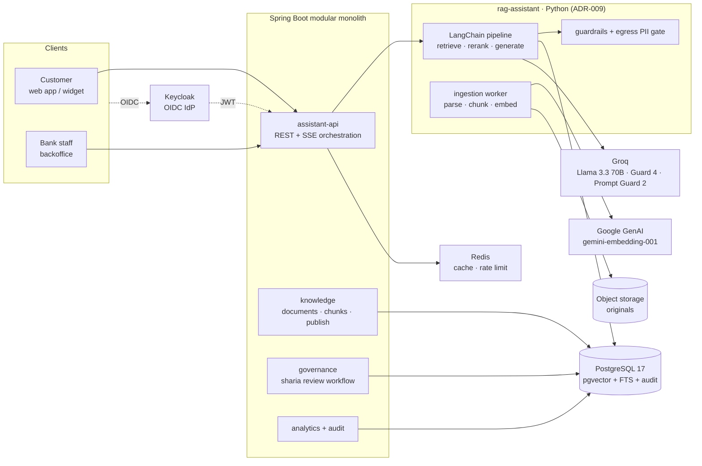

# 00 — Executive Summary

## 1. Objective

Give Al Baraka Bank Tunisia a **trilingual (FR / AR / EN) conversational assistant** that answers
customer and staff questions about the bank's participatory-finance products, procedures and
Islamic-finance concepts — **strictly from Sharia-approved content**, **always citing its sources**,
and **continuously improvable by bank administrators without a software release**.

Two facades are delivered from one backend:

* **Frontoffice** — customer-facing chat (standalone web app + embeddable widget on the bank site).
* **Backoffice** — administrative console that owns the assistant's knowledge, prompts, guardrails,
  retrieval tuning, Sharia review workflow, quality loop and analytics.

## 2. The core problem this design solves

A generic LLM in a bank is unacceptable for three distinct reasons, and the architecture addresses
each with a different mechanism:

| Risk | Naive behaviour | Mechanism in this design |
|---|---|---|
| **Hallucination** — inventing products, fees, rates, procedures | Confident wrong answer | Retrieval-grounded generation; a chunk-level citation is mandatory; an output **grounding check** rejects answers whose claims are not attributable to retrieved chunks; explicit "I don't know" path |
| **Sharia non-conformity** — describing a product in riba terms, issuing a ruling, endorsing a haram use | Religiously and reputationally damaging | Content is only retrievable when `SHARIA_APPROVED` **and** `PUBLISHED`; a **no-fatwa rule** is enforced in prompt *and* by an output policy classifier; ruling requests are converted into tickets for the Sharia committee |
| **Uncontrolled drift** — behaviour changed by whoever edits a prompt at 18:00 | Silent regressions, no accountability | Prompts, policies and retrieval parameters are **versioned data** activated through a **two-eyes** approval flow, with a hash-chained audit trail and an **evaluation gate** in CI/CD |

A fourth, Tunisia-specific risk is **cross-border data transfer** (Groq and Google are US-hosted).
This is treated as a first-class architectural constraint in
[`07-security-iam-compliance.md`](07-security-iam-compliance.md): v1 sends **no personal data** to
model providers, a PII gate redacts before egress, and the provider layer is an interface so an
on-premises inference profile can be switched on when Compliance requires it.

## 3. Decisions taken

Confirmed with the project owner:

1. **LLM = Groq** (OpenAI-compatible endpoint, `https://api.groq.com/openai/v1`), integrated through
   Spring AI's OpenAI model starter.
2. **Embeddings = Google** `gemini-embedding-001` (multilingual, 100+ languages incl. Arabic and
   French, Matryoshka dimensions), integrated through Spring AI's Google GenAI embedding support.
3. **Vector store = PostgreSQL + pgvector** (chosen for us: one database for relational, vector,
   full-text and audit data → the smallest operational surface a bank can defend).
4. **Identity = Keycloak** (OIDC SSO, MFA for the backoffice, realm roles).
5. **This iteration = architecture and specification**, code in the following phases.

Design decisions we took and can revisit — each has an ADR:

6. **Modular monolith**, not microservices (ADR-005). A bank team of this size does not benefit from
   distributed tracing on day one; module boundaries are enforced so extraction stays possible.
7. **Hybrid retrieval** (dense + Postgres FTS + trigram, fused by Reciprocal Rank Fusion) rather
   than pure vector search (ADR-003). Exact terminology — *Mourabaha*, *marge bénéficiaire*,
   *المرابحة* — must match literally, and Arabic morphology makes pure dense search fragile.
8. **One shared multilingual embedding space** plus per-chunk FR/AR/EN renderings, rather than three
   separate monolingual indexes (ADR-007). This is what makes an Arabic question retrieve a
   French-authored policy document, which is the normal case in a Tunisian bank.
9. **LLM-based listwise reranking on a cheap Groq model** in v1, with an on-prem cross-encoder
   sidecar as the v2 option (ADR-003).
10. **Sharia review is a gate on content, not a filter on output** (ADR-006). Output filtering is a
    defence-in-depth layer; the primary control is that non-approved content is *unreachable*.

## 4. Platform baseline (September 2026)

| Layer | Version | Note |
|---|---|---|
| Java | 21 (LTS) | Spring Boot 4 baseline is 17; 21 recommended (virtual threads) |
| Spring Boot | 4.1.x | Boot 3.5 reached OSS end-of-life on 30 June 2026 → new builds go to 4.x |
| Spring AI | 2.0.x | GA 12 June 2026; **requires** Spring Boot 4; Jackson 3, JSpecify |
| Angular | 22.x | Released 3 June 2026; stable Signal Forms and Angular ARIA (accessibility) |
| Keycloak | ≥ 26.6.3 | 26.6.3 is a security release (16 CVEs) — minimum acceptable |
| PostgreSQL | 17 | with `pgvector` 0.8.1 (HNSW iterative index scans), `pg_trgm`, `unaccent` |
| Object storage | S3-compatible (MinIO in dev) | Original ingested documents, immutable |

Version rationale and the Spring Boot 3.5 EOL / Spring AI 1.x-vs-2.x coupling are documented in
[ADR-008](adr/ADR-008-platform-versions.md).

## 5. Architecture at a glance

## 6. What "upgradeable by admins" concretely means

Every lever below is a **backoffice screen writing to a versioned table**, never a code change:

| Lever | Table | Approval needed |
|---|---|---|
| Knowledge (products, procedures, FAQ, Sharia notes) | `document`, `document_version`, `chunk` | KB_EDITOR → SHARIA_OFFICER |
| Terminology (canonical FR/AR/EN terms) | `term_glossary` | KB_EDITOR → SHARIA_OFFICER for religious terms |
| System prompts & persona, per locale | `prompt_template`, `prompt_version` | AI_ENGINEER → SHARIA_OFFICER if it touches religious wording |
| Retrieval parameters (top-k, weights, thresholds, filters) | `retrieval_config` | AI_ENGINEER |
| Model routing (which Groq model, temperature, budget) | `model_config` | AI_ENGINEER + ADMIN |
| Guardrail policies (banned topics, refusal templates, PII rules) | `guardrail_policy` | COMPLIANCE → SHARIA_OFFICER |
| Suggested questions, disclaimers, UI microcopy | `assistant_config` | KB_EDITOR |
| A/B experiments & canary rollout | `experiment` | AI_ENGINEER + ADMIN |
| Correction of a bad answer found in QA | `feedback` → KB or prompt change | per the change type above |

Activation of any of these produces an immutable `audit_event` (hash-chained) and triggers the
evaluation gate described in [`11-quality-evaluation.md`](11-quality-evaluation.md).

## 7. Delivery plan (summary)

| Phase | Content | Exit criteria |
|---|---|---|
| **0 — Architecture** *(this document set)* | Design, contracts, DDL, ADRs, golden set seed | Sign-off by Architecture, Compliance and the Sharia committee chair |
| **1 — Foundations** | Repo skeleton, CI, Keycloak realm, Postgres+pgvector, Flyway, OpenAPI codegen, Angular shells with i18n/RTL, health/metrics | Both apps authenticate and render FR/AR/EN with correct RTL |
| **2 — RAG core** | Ingestion pipeline, embedding jobs, hybrid retrieval, reranking, grounded generation, SSE streaming, citations | Frontoffice answers a 40-question golden set with ≥ 85 % faithfulness |
| **3 — Governance & backoffice** | Content lifecycle, Sharia review board, prompt studio, retrieval lab, audit, RBAC hardening | A KB change cannot reach production without two approvals; audit trail exports |
| **4 — Quality & guardrails** | Eval harness in CI, moderation models, PII gate, refusal taxonomy, feedback loop, cost accounting | Release gate green; Sharia-policy violation rate < 1 % on the golden set |
| **5 — Scale & integration** | Redis caching, rate limiting, canary/A-B, observability dashboards, DR runbook, widget on the bank site | P95 < 3 s under 50 concurrent conversations; DR tested |
| **6 — Optional extensions** | Account servicing adapter (authenticated), voice input (Groq Whisper), agent-assist mode, on-prem inference profile | Scoped separately; each needs a Compliance opinion |

Detail, effort estimates and acceptance criteria: [`13-roadmap-delivery-plan.md`](13-roadmap-delivery-plan.md).

## 8. Top risks and mitigations

| # | Risk | Impact | Mitigation |
|---|---|---|---|
| R1 | Cross-border transfer of customer data to US model providers | Regulatory (Loi 2004-63 / INPDP), reputational | No personal data in v1 scope; PII redaction gate before egress; DPA; on-prem inference profile ready (ADR-002) |
| R2 | Groq free/low-tier rate limits (≈1 000 requests/day on `llama-3.3-70b-versatile`) | Outage at launch | Paid tier contract, provider budget guard, semantic response cache, graceful degradation to `llama-3.1-8b-instant`, then to a "contact the bank" fallback |
| R3 | Embedding model change forces a full re-index | Downtime / cost | `embedding_model` + `embedding_dim` recorded per chunk; blue-green index; re-embedding job with rollback |
| R4 | Arabic retrieval quality (morphology, diacritics, Derja) | Wrong or missing answers | Normalisation + light stemming pipeline, hybrid retrieval, per-chunk Arabic renderings, Arabic-weighted golden set |
| R5 | Sharia committee bandwidth for content review | Launch delay | Bulk-approve existing already-published bank content; risk-tiered review (see 05 §4); reviewer queue with SLA in the backoffice |
| R6 | Prompt injection / jailbreak into religious or financial advice | Reputational, legal | Prompt Guard 2 pre-filter, system-prompt isolation, no tools in v1, strict output schema, output classifier, rate limiting, red-team suite |
| R7 | Hallucinated fees, rates or product conditions | Customer harm, legal | Numeric-claim validator against KB; refusal instead of estimation; mandatory citation; disclaimer |
| R8 | Scope creep toward core banking | Delivery risk | Non-goals stated in README and enforced by absence of adapters |

## 9. Open questions for the bank (blocking Phase 1 sign-off)

1. **Data residency**: does Compliance accept a US-hosted inference/embedding provider for
   *non-personal* content, and under which contractual instrument?
2. **Sharia committee**: who are the named reviewers, and what SLA can they commit to for content
   review (target: 5 business days)? Is a risk-tiered fast track acceptable for content already
   published on `albaraka.com.tn`?
3. **Content sources**: authoritative list of documents to seed the KB (product sheets, tariff
   booklet *conditions de banque*, procedures, AAOIFI standards excerpts, committee opinions).
4. **Keycloak**: reuse the bank's existing IdP/realm or stand up a dedicated one? LDAP/AD federation?
5. **Hosting**: bank datacentre (OpenShift/VMware), local cloud, or managed? This drives the
   deployment topology in [`12-deployment-observability.md`](12-deployment-observability.md).
6. **Channels**: is the widget on the public site in v1, or internal-only (branch agents) first?
7. **Languages priority**: Arabic first (Tunisian market) or French first (existing documentation)?
   Affects the seeding order, not the architecture.
8. **Budget envelope** for token consumption, to size the cache and the model routing policy.
