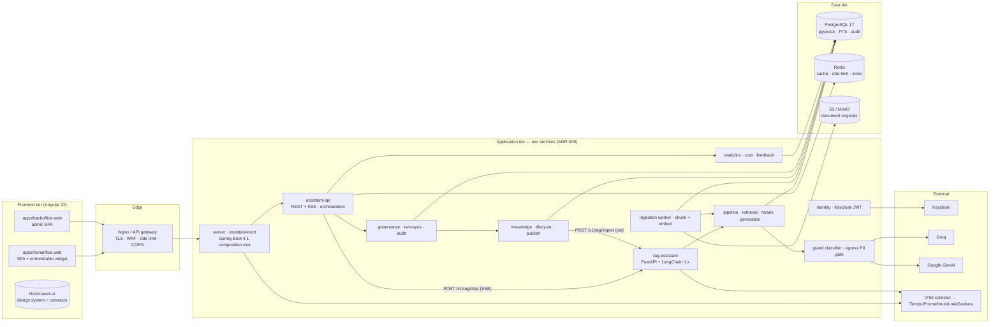
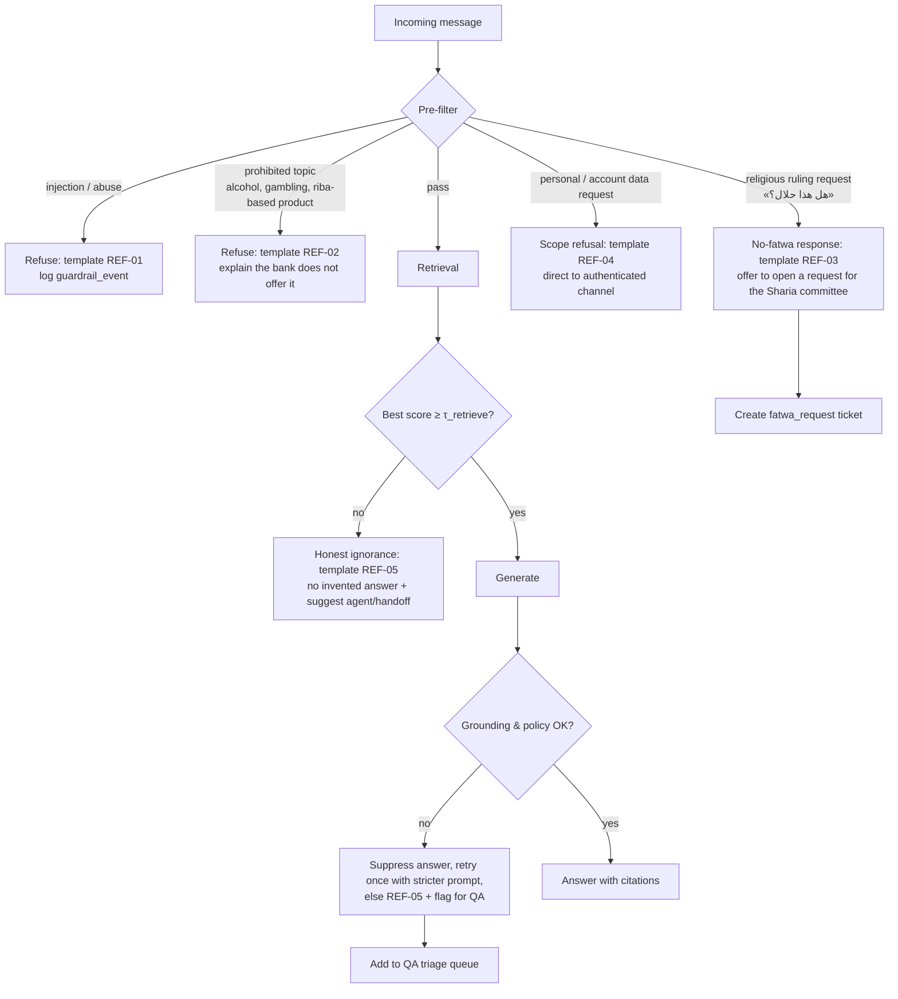
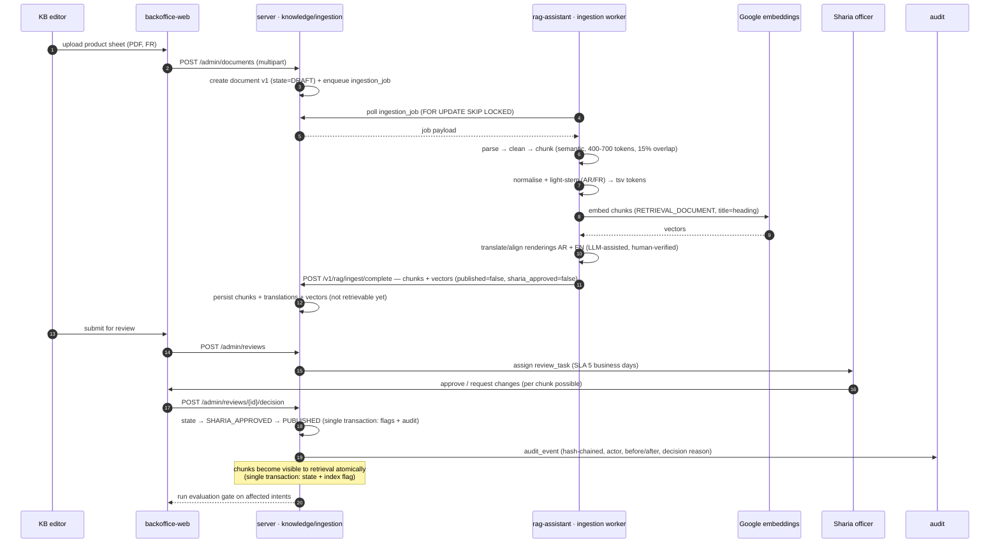

# 01 — System Architecture

## 1. Context (C4 level 1)


**Trust boundaries**: everything left of the dashed line is bank-controlled. Groq and Google calls
cross the boundary and therefore pass through the **egress PII gate** (§7.4) — no personal data,
no account data, no credentials.

## 2. Container view (C4 level 2)



**Deployment units**: 2 static SPA bundles + 1 Spring Boot jar + 1 Python service (Uvicorn)
+ Postgres(pgvector) + Redis + object storage + Keycloak. The Python service is the **only**
container that talks to Groq/Google — one egress point, one place where the PII gate lives
(§7.4). Ingestion is a DB-backed job queue consumed by the Python worker (`FOR UPDATE SKIP LOCKED`),
triggered by the Spring API; profiles can split the worker out later.

## 3. Module boundaries (component view)

### 3.0 Service split at a glance

| Concern | Spring `server` | Python `rag-assistant` |
|---|---|---|
| Auth, RBAC, MFA | ✅ Keycloak resource server | — |
| Conversations, messages, traces, cost | ✅ owns tables | — |
| KB lifecycle, publication, Sharia two-eyes | ✅ owns the flags | reads only |
| Audit hash chain | ✅ | — |
| Hybrid retrieval (pgvector + FTS), rerank, generation | — | ✅ LangChain |
| Provider calls, egress PII gate, guard classification | — | ✅ single choke point |
| SSE to the browser | ✅ proxies | ✅ produces frames |

### 3.1 Maven modules (Spring)

Modules communicate through **published interfaces only** — enforced by
[ArchUnit](https://www.archunit.org/) tests in CI:

| Module | Responsibility | Owns tables | Must NOT |
|---|---|---|---|
| `assistant-api` | REST controllers, SSE orchestration (calls RAG service), DTO mapping | — | Contain business rules or SQL |
| `assistant-identity` | JWT validation, claims→authorities mapping, tenant/locale resolution | `user_preference` | Talk to Keycloak admin API from request threads |
| `knowledge` | Documents, versions, chunks, translations, glossary, collections, publication state | `document`, `document_version`, `chunk`, `chunk_translation`, `term_glossary`, `collection` | Call a model |
| `ingestion` | Intake API, job queue (files → `ingestion_job`/`embedding_job`), re-index orchestration | `ingestion_job`, `embedding_job` | Parse content or embed (Python does) |
| `governance` | Sharia review workflow, approvals, two-eyes enforcement, fatwa-request routing | `review_task`, `sharia_review`, `fatwa_request` | Publish content itself (it flips state, `knowledge` reacts) |
| `analytics` | Metrics aggregation, feedback, QA queues, cost/token accounting, dashboards API | `feedback`, `conversation_metric`, `token_usage`, `eval_run` | Mutate knowledge |
| `audit` | Append-only hash-chained event log, export for regulators/committee | `audit_event` | Update or delete a row (DB trigger forbids it) |
| `rag-client` | HTTP client for the internal RAG contract, SSE stream-through, degradation ladder | — | Contain RAG logic |

Model adapters (Groq chat, Google embeddings, vector store) are **not** Maven modules anymore —
they live in `rag_assistant` (ADR-009).

### 3.2 Why a modular monolith + one small service

See [ADR-005](adr/ADR-005-modular-monolith.md) and [ADR-009](adr/ADR-009-python-rag-service.md).
The Spring application stays a **modular monolith** (one transaction boundary for
"publish chunk + flip index flag + write audit"), and exactly one **model-bound** concern is
extracted into the Python service. Splitting the governance invariant itself into services is
still rejected: the Sharia gate stays inside one transaction.

## 4. Runtime flows

### 4.1 Frontoffice — ask a question (happy path)

```mermaid
sequenceDiagram
    autonumber
    participant U as Customer (AR)
    participant FE as frontoffice-web
    participant NG as Nginx
    participant API as server · assistant-api
    participant RAG as rag-assistant · LangChain
    participant PG as Postgres/pgvector
    participant EMB as Google embeddings
    participant LLM as Groq (Llama 3.3 70B)

    U->>FE: «شنيا الفرق بين المرابحة والإجارة؟»
    FE->>NG: POST /api/v1/assistant/conversations/{id}/messages (SSE)
    NG->>API: JWT (optional for anonymous) + locale=ar-TN
    API->>API: persist user message (FK idempotency) + pre-filter REF-01/04
    API->>RAG: POST /v1/rag/chat — SSE, service token, X-RAG-Contract: 1
    RAG->>RAG: detect language → ar; classify intent → PRODUCT_COMPARISON
    RAG->>RAG: normalise Derja→MSA, strip diacritics, expand glossary synonyms
    RAG->>EMB: embed(query, taskType=RETRIEVAL_QUERY, dim=1536)
    EMB-->>RAG: vector
    RAG->>PG: hybrid search — HNSW cosine + FTS tsquery + trigram, filtered by<br/>published AND sharia_approved AND audience IN (PUBLIC,AGENT)
    PG-->>RAG: 40 candidates with scores
    RAG->>LLM: listwise rerank (llama-3.1-8b-instant, JSON output)
    LLM-->>RAG: ordered top-8
    RAG->>RAG: assemble context ≤ token budget, dedupe, attach citation ids [S1..S8]
    RAG->>RAG: egress PII gate (redact payload → llm_call log entry)
    RAG->>LLM: chat completion, stream=true, structured answer contract
    LLM-->>RAG: tokens…
    RAG->>RAG: post-filter (grounding · Sharia policy · numeric validator) → REF-05 if failed
    RAG-->>API: SSE frames: status*, sources, token*, answer|refusal|error, done
    API->>PG: persist message, retrieval_trace, candidates, cost
    API-->>FE: SSE frames forwarded 1:1 (same vocabulary)
    FE-->>U: RTL-rendered answer with clickable sources
```

**Latency budget** (P95): internal hop ~3 ms · guard pre-filter 250 ms · embedding 200 ms ·
hybrid search 60 ms · rerank 400 ms · first token 700 ms · full answer 2.5 s → **< 3 s perceived**.
Cached questions (short-TTL semantic cache) skip embedding+retrieval and answer in < 800 ms.

### 4.2 Refusal / out-of-scope path



The refusal taxonomy (codes, trilingual templates, when each applies) is data in
`guardrail_policy` and editable in the backoffice — see [`09-backoffice-spec.md`](09-backoffice-spec.md) §6.

### 4.3 Backoffice — publish new knowledge (the "polish" loop)



**Two-eyes rule**: the submitter can never be the approver (enforced in `governance`, not in the UI).

### 4.4 Prompt / model change (runtime upgrade, no deploy)

```mermaid
flowchart LR
    A[AI engineer edits prompt v(n+1)<br/>in Prompt Studio] --> B[Retrieval Lab:<br/>replay 20 sample queries<br/>diff answers & citations]
    B --> C[Save as DRAFT version]
    C --> D{Touches religious<br/>wording or policy?}
    D -->|yes| E[SHARIA_OFFICER approval]
    D -->|no| F[Second AI_ENGINEER / ADMIN approval]
    E --> G[Activate: canary 10% traffic]
    F --> G
    G --> H[Evaluation gate on golden set<br/>faithfulness · policy violation rate]
    H -->|green| I[Promote to 100%]
    H -->|red| J[Auto-rollback to v(n)<br/>incident recorded]
```

## 5. Backend layering

### 5.1 Java (each Maven module)

```
tn.albaraka.ai.<module>
├── api            ← controllers, DTOs, mappers (inbound adapters)
├── application    ← use cases / services, transactions, ports
├── domain         ← entities, value objects, invariants (no Spring, no JPA)
└── infrastructure ← JDBC repositories, HTTP clients, caches (outbound adapters)
```

Rules enforced by ArchUnit:
* `domain` depends on nothing but the JDK and `jakarta.validation`.
* `api` never touches `infrastructure`.
* No module imports another module's `infrastructure` or `domain` — only its `api` interfaces
  (exposed as `tn.albaraka.ai.<module>.spi`).
* All outbound HTTP goes through `rag-client` (service token, retries, circuit breaker, budget
  accounting in one place). The **only** outbound LLM/embedding traffic is in `rag-assistant`.

### 5.2 Python (`rag_assistant` package)

```
rag_assistant/
├── api            ← FastAPI routers (health, chat SSE, ingest, ingest/complete)
├── pipeline       ← LangChain chain: normalise → hybrid retriever → rerank → prompt → generation
├── retrieval      ← PGVectorStore + hybrid SQL (vector, tsvector, trigram), mock fallback
├── guardrails     ← REF-01/03/04/05 classification, PII regex, egress gate, redaction
├── providers      ← ChatGroq / GoogleEmbeddings / deterministic Mock* fallbacks
└── config         ← pydantic-settings
```

## 6. Frontend architecture

One Angular 22 workspace (`apps/`) with two applications and one shared library:

```
apps/frontoffice-web   ← chat experience, widget entry point, public KB search
apps/backoffice-web    ← admin console (lazy-loaded feature routes)
apps/shared-ui         ← chat bubble, source card, locale switcher, RTL layout shell,
                          accessible data table, approval stepper + trilingual dictionary
```

* **Standalone components only**, signal-based state, `OnPush`/zoneless (Angular 22 default).
* **State**: signals + a thin store per feature; RxJS only for HTTP/SSE streams.
* **SSE**: `fetch` + `ReadableStream` (native `EventSource` cannot POST) wrapped in a
  `ChatStreamService` exposing a signal of partial tokens.
* **i18n**: runtime locale loading with `dir` switching through the `shared-ui` dictionary and
  `<html lang/dir>` (see [`06-i18n-trilingual-rtl.md`](06-i18n-trilingual-rtl.md)).
* **Auth**: Keycloak OIDC PKCE (backoffice requires MFA). Frontoffice allows anonymous use with
  an ephemeral device id; in the local demo profile, a dev login endpoint stands in for Keycloak
  (see `server/README.md`).
* **Design system**: custom Al Baraka theme (green/gold palette, Arabic-first typography) in
  `shared-ui` — no Material dependency in the demo build.

## 7. Cross-cutting concerns

### 7.1 Configuration
`application.yaml` + profile overlays (`dev`, `test`, `uat`, `prod`). **Runtime** behaviour
(prompts, models, retrieval, policies) lives in the database, not in YAML — YAML only holds
infrastructure coordinates. Reference configs: [`specs/config/`](../specs/config).

### 7.2 Resilience
Every external call: timeout, retry with jitter (idempotent only), circuit breaker, bulkhead.
Degradation ladder for generation:

1. `llama-3.3-70b-versatile` (primary)
2. `openai/gpt-oss-120b` or `llama-3.1-8b-instant` (fallback on 429/5xx)
3. Cached answer for a semantically equivalent question (similarity ≥ 0.95, ≤ 24 h old)
4. Retrieval-only response: "here are the 3 most relevant approved sources" (no generation)
5. Static trilingual fallback: contact the bank / nearest branch

The ladder step used is recorded in `retrieval_trace` and surfaced in analytics — a spike in
step 4/5 is an alert.

### 7.3 Idempotency & concurrency
* Message POST carries `Idempotency-Key` (client-generated UUID) → duplicate submits are no-ops.
* Ingestion jobs use `SELECT … FOR UPDATE SKIP LOCKED` on the job table (no external broker in v1).
* Optimistic locking (`@Version`) on `document_version`, `prompt_version`, `retrieval_config`.

### 7.4 Egress data-protection gate (single choke point — lives in `rag-assistant`)

The Python service is the **only** process that can reach Groq/Google, so the `EgressGuard`
implemented there is the single choke point. The Spring side never sends provider-bound payloads
(the internal contract only ever carries `PUBLIC`/`INTERNAL` content and a service token):
1. PII detection (regex + NER for CIN, phone, RIB/IBAN, account numbers, email, address, name patterns).
2. Redaction with reversible tokens (`⟦PII_1⟧`) kept only in service memory for the request duration.
3. Payload size and content-class check (`PUBLIC` / `INTERNAL` only — never `CONFIDENTIAL`).
4. Request/response logging **with the redacted payload** to `llm_call_log` (via Spring, which owns
   the table) for cost & audit.
5. Kill switch: a single config flag routes everything to the on-prem profile (§ ADR-002) or to
   the degradation ladder.

### 7.5 Internationalisation of the backend
Error messages, refusal templates and validation messages are keyed
(`error.retrieval.no_result`) and resolved from `message_bundle` rows (DB-driven, admin-editable)
with fallback to `messages_{fr,ar,en}.properties`. Never hard-code a language in a controller.

## 8. Environments

| Env | Purpose | Data | Models |
|---|---|---|---|
| `local` | Developer machine, docker-compose | Synthetic KB | Groq/Google with personal keys, or `mock` profile |
| `dev` | Integration | Anonymised KB | Same as prod, separate keys, low budget |
| `uat` | Sharia committee + business acceptance | **Real** approved KB copy | Prod models, prod-like limits |
| `prod` | Live | Real | Prod |

`uat` holds a **byte-identical copy of the approved knowledge base** so the Sharia committee
reviews what customers will actually see. Promotion dev→uat→prod carries the KB delta, the prompt
version and the model config together as a **release bundle** (see [`12-deployment-observability.md`](12-deployment-observability.md) §6).

## 9. Verification strategy

| Layer | Tooling | Gate |
|---|---|---|
| Domain unit | JUnit 5, AssertJ | ≥ 80 % line coverage on `domain` + `application` |
| Architecture | ArchUnit | module dependency rules; build fails on violation |
| Integration | Testcontainers (Postgres+pgvector, Redis) | every PR |
| Contract | OpenAPI diff (`oasdiff`) | breaking change ⇒ major version bump required |
| LLM adapters | WireMock-recorded fixtures | tests never call paid APIs |
| RAG quality | Eval harness on golden set | faithfulness ≥ 0.85, policy-violation ≤ 1 % |
| Frontend | Vitest + Angular Testing Library, Playwright e2e | a11y (axe) + RTL snapshot tests |
| Security | OWASP dependency-check, Trivy, ZAP baseline | no HIGH unpatched |

## 10. Non-functional targets

| Attribute | Target |
|---|---|
| Availability | 99.5 % during banking hours (07:30–18:00 TZ), 99.0 % off-hours |
| Latency | P95 first token < 1.2 s; full answer < 3 s; admin screens < 400 ms |
| Throughput | 50 concurrent conversations; 200 msg/min peak; ingestion 5 000 chunks/h |
| Retention | Conversations 24 months (anonymisable); audit 10 years; originals indefinite |
| Data classification | `PUBLIC` / `INTERNAL` / `CONFIDENTIAL` / `RESTRICTED` on every document; only the first two may reach a model provider |
| Accessibility | WCAG 2.2 AA, full RTL, screen-reader labelled citations |
| Localisation | FR, AR (ar-TN), EN; adding a 4th language = data, not code |
