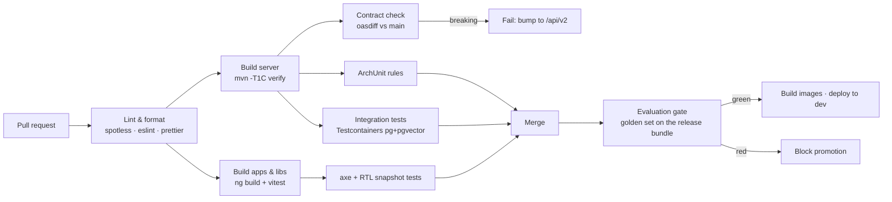

# 02 — Repository Layout & Build Topology

Single repository (`albaraka-ai`), trunk-based development, one CI pipeline. A monorepo is chosen
because the API contract, the database schema, the prompts and both UIs must evolve together and be
reviewed in one pull request — splitting them would make "change a prompt and see it in the UI"
cross-repository.

> **Important — 2026-09-03:** phases 1–6 are now being **executed**, not only specified.
> The repository therefore contains two layers:
>
> * **Runtime tree (§1.a)** — what actually runs today in this repository: the Node
>   parity backend (`server/`) and the Angular 22 workspace (`albaraka-web/`). This is
>   the executable implementation of the documented contracts (same REST + SSE grammar,
>   same `specs/db/schema.sql` executed verbatim, same governance rules).
> * **Target production topology (§1.b)** — the Spring Boot / Java 21 multi-module
>   topology, `apps/`, `libs/`, `deploy/docker`, `deploy/k8s`, `deploy/nginx` and the
>   `Makefile` Maven targets described by the Phase 0 design. These remain the
>   documented production target (they cannot be built in this sandbox: no JVM, no
>   Docker), and are marked **planned** below.
>
> The tree below lists only real files; **planned** entries are explicitly labelled.

## 1.a  Runtime tree (executed — everything here exists and runs)

```
albaraka-ai/
├── README.md
├── Makefile                                 (real targets: dev, web, admin, eval, seed,
│                                              verify-db, spike, build, lint-all)
├── docs/                                    ← design documentation
│   ├── 00…13-*.md
│   ├── glossary-trilingual.md
│   └── adr/ADR-00x-*.md
├── specs/                                   ← machine-readable contracts (source of truth)
│   ├── openapi.yaml                         (68 paths · 81 operations · 86 schemas)
│   ├── asyncapi.yaml                        (SSE + internal job events; tools/asyncapi-lint)
│   ├── db/
│   │   ├── schema.sql                       (reference DDL; executed verbatim by server/db.js)
│   │   ├── seed/                            ← GENERATED by tools/seed-gen
│   │   │   ├── V900__seed_glossary.sql    V901__seed_prompts.sql
│   │   │   ├── V902__seed_policies.sql    V903__seed_dialect.sql
│   │   │   └── README.md
│   │   └── tests/  (schema_test.sql · seed_test.sql)
│   ├── prompts/  (system.assistant.{fr,ar,en}.md · guardrail.sharia.judge.md ·
│   │              utility.prompts.md · templates.refusals.yaml)
│   ├── i18n/  (README.md · normalization.json · derja-msa.json)
│   ├── eval/  (README.md · kb-manifest.jsonl · golden-set.jsonl · red-team.jsonl)
│   ├── keycloak/  (README.md · albaraka-realm.json)
│   └── config/  (README.md · application.yaml · application-{dev,uat,prod}.yaml)
├── server/                                  ← EXECUTED backend (Node 22 parity)
│   ├── package.json  package-lock.json
│   ├── README.md                            (real vs mocked layers, dev users, SSE contract)
│   ├── src/
│   │   ├── index.js                         (Express entrypoint: health, auth, mounts)
│   │   ├── config.js  db.js  auth.js  providers.js  rag.js  pipeline.js  seed-demo.js
│   │   └── routes/  (public.js — chat/SSE/config/feedback; admin.js — governance)
│   └── scripts/  (db-bootstrap.mjs · eval-golden.mjs — 8-case golden gate, 8/8 green)
├── albaraka-web/                            ← EXECUTED Angular 22 workspace
│   ├── package.json  angular.json  tsconfig.json  proxy.conf.json  README.md
│   └── projects/
│       ├── frontoffice-web/                 (public assistant chat — :4200)
│       ├── backoffice-web/                  (admin console — :4201)
│       └── shared-ui/                       (design tokens, i18n dictionary, md→HTML)
├── deploy/                                  ← local/dev topology (compose is lint-verified)
│   ├── docker-compose.yml  README.md  postgres/init/  runbooks/  (13 runbooks)
│   └── docker/  k8s/  nginx/                ← planned (production images/manifests)
├── tools/                                   ← every one is a CI gate; each linter ships a
│   │                                          mutation self-test proving it can fail
│   ├── seed-gen/  db-verify/  prompt-lint/  eval-lint/  realm-lint/  config-lint/
│   ├── i18n-lint/  asyncapi-lint/  compose-lint/  spike/  (kb-import & codegen: planned)
├── .github/workflows/                       (ci.yml, eval-gate.yml, release.yml — planned)
├── .gitignore  .env.example  .editorconfig  .gitattributes  Makefile
```

## 1.b  Target production topology (Phase 0 design — **planned**, not yet built)

The production implementation targets Spring Boot 4 / Java 21 (Maven multi-module) with the
same contracts; the Node parity backend is the executable stand-in until that stack can be
built (no JVM / Docker in the current sandbox):

```
server/     ← planned module layout for the Spring implementation
├── pom.xml  mvnw  mvnw.cmd  .mvn/
├── assistant-domain-shared/  assistant-infra/  assistant-identity/
├── assistant-audit/  assistant-knowledge/  assistant-ingestion/
├── assistant-guardrails/  assistant-rag/  assistant-governance/
├── assistant-analytics/  assistant-api/  assistant-boot/  assistant-eval/
apps/       ← planned
├── frontoffice-web/  backoffice-web/
libs/       ← planned
├── shared-ui/  shared-contracts/  shared-i18n/
deploy/     ← planned additions
├── docker/  (server, web, keycloak theme)   k8s/   nginx/
```

## 2. Naming & coding conventions

**Runtime tree (`server/` + `albaraka-web/`)** keeps the same conventions that the
Phase 0 design set for the target stack, so a later port to Spring is a translation,
not a redesign:

| Area | Convention |
|---|---|
| Java package root (planned) | `tn.albaraka.ai` |
| Java module prefix (planned) | `assistant-` |
| REST base path | `/api/v1` (public), `/api/v1/admin` (backoffice) |
| DB objects | `snake_case`, singular table names, `idx_<table>_<cols>`, `fk_<table>_<ref>` |
| Angular | standalone components, signal inputs, no `NgModule` |
| Locale codes | `fr-FR`, `ar-TN`, `en-GB` (BCP-47, used end-to-end: HTTP → JWT → DB → UI) |
| Git branches | `feat/…`, `fix/…`, `chore/…`, `docs/…` off `main`; squash merges |
| Commits | Conventional Commits (drives CHANGELOG) |
| IDs | UUIDv7 for all entities (time-ordered → better index locality than UUIDv4) |
| Money | ISO currency `TND`; never `double` |

## 3. Maven parent — pinned versions

```xml
<properties>
  <java.version>21</java.version>
  <spring-boot.version>4.1.1</spring-boot.version>
  <spring-ai.version>2.0.0</spring-ai.version>   <!-- requires Boot 4 -->
  <postgresql.version>17</postgresql.version>
  <pgvector.version>0.8.1</pgvector.version>
  <flyway.version>11.x</flyway.version>
  <archunit.version>1.4.x</archunit.version>
  <testcontainers.version>1.21.x</testcontainers.version>
  <jjwt.version>0.13.x</jjwt.version>
</properties>
```

Key starters in `assistant-infra`:

| Starter | Used for |
|---|---|
| `spring-ai-starter-model-openai` | Groq chat completions (`base-url=https://api.groq.com/openai/v1`) |
| `spring-ai-starter-model-google-genai` | `gemini-embedding-001` embeddings |
| `spring-ai-starter-vector-store-pgvector` | pgvector `VectorStore` (customised for hybrid search) |
| `spring-boot-starter-oauth2-resource-server` | Keycloak JWT validation |
| `spring-boot-starter-data-jpa` + `flyway-core` | persistence & migrations |
| `spring-boot-starter-webflux` | `WebClient` for provider calls + SSE support |
| `spring-boot-starter-actuator` + `micrometer-tracing-bridge-otel` | health, metrics, tracing |
| `spring-boot-starter-validation` | bean validation |

> **Groq through Spring AI**: Groq has no first-party starter; it is OpenAI-compatible, so the
> OpenAI starter is pointed at Groq's base URL. Two Groq quirks to respect: no multimodal messages,
> and some OpenAI parameters are ignored/rejected (`logprobs`, `n>1`, `presence_penalty` on some
> models). These are handled by a `GroqChatOptionsSanitizer` in `assistant-infra`.
>
> **Second Groq client for the guard models**: `llama-guard-4-12b` and `llama-prompt-guard-2-86m`
> are declared as separate named `ChatModel` beans (`guardModel`, `promptGuardModel`) so the primary
> and moderation paths have independent timeouts, rate limits and circuit breakers.

## 4. Angular workspace (executed)

```jsonc
// albaraka-web/angular.json (abridged)
{
  "projects": {
    "frontoffice-web": { "architect": { "serve": { "options": {
        "port": 4200, "host": "0.0.0.0", "proxyConfig": "proxy.conf.json", "allowedHosts": true } } } },
    "backoffice-web":  { "architect": { "serve": { "options": {
        "port": 4201, "host": "0.0.0.0", "proxyConfig": "proxy.conf.json", "allowedHosts": true } } } },
    "shared-ui":       { "projectType": "library" }
  }
}
```

* **One build, three locales at runtime** (dictionaries live in `shared-ui` and switch instantly
  with the RTL flip; the `<html>` `lang`/`dir` attributes follow the selected locale). Rationale in
  [`06-i18n-trilingual-rtl.md`](06-i18n-trilingual-rtl.md) §3.
* The production design adds `shared-contracts` (generated TS types) and `shared-i18n` as separate
  libraries, plus a `widget` build target for the embedded assistant — **planned** (see §1.b).
* Dev-server proxy (`proxy.conf.json`) forwards `/api` to the backend on `:8080`, so the browser
  only ever talks to one origin (no CORS in dev, no hard-coded hosts). `allowedHosts: true` is set
  for sandbox preview hosting only and must be removed for production builds.

## 5. CI pipeline



The **evaluation gate** is what makes "admins can polish the assistant" safe: any change to prompts,
retrieval config, guardrail policy or KB content produces a *release bundle* that must pass the
golden set before promotion — see [`11-quality-evaluation.md`](11-quality-evaluation.md).

## 6. Local development (executed)

```bash
make dev            # server: Express + embedded PostgreSQL on :8080 (schema + seeds + demo KB)
make web            # frontoffice-web on :4200 (proxy → :8080)
make admin          # backoffice-web on :4201 (proxy → :8080)
make seed           # re-initialise the embedded demo database
make eval           # 8-case golden gate on the running backend (8/8 green)
make spike          # tools/spike: provider smoke tests (mock; real keys when present in .env)
make verify-db      # schema.sql + schema_test.sql against a throwaway PostgreSQL (26 assertions)
make lint-all       # every specification gate (seed-gen check + 8 linters + db-verify)
```

`make dev` starts the backend **and** an embedded PostgreSQL data directory
(`server/.pgdata`, port 55433) that executes `specs/db/schema.sql` verbatim (`vector` columns
stubbed as `real[]` for the demo, see `tools/db-verify`) and applies the Flyway seeds V900–V903
plus the trilingual demo knowledge base. With `GROQ_API_KEY`/`GOOGLE_API_KEY` set, the same
backend uses the real providers; without them it runs the deterministic `local-mock` adapters
(`PROVIDER_MODE=MOCK`, default) — this is also what the CI evaluation gate uses.

The raw gates (no Makefile required) are:

```bash
node tools/seed-gen/generate.mjs --check     # specs/db/seed matches its sources; boundary audit
cd tools/db-verify && npm run verify         # schema.sql + schema_test.sql   → 26 assertions
cd tools/db-verify && npm run verify:seed    # schema + all four seeds + seed_test.sql → 23 assertions
for t in prompt eval realm config i18n; do node tools/$t-lint/lint.mjs; done
for t in prompt eval realm config i18n; do node tools/$t-lint/self-test.mjs; done
cd tools/asyncapi-lint && npm run verify   # asyncapi.yaml vs docs/08 §3.1 + §6         → 31 mutations
cd tools/compose-lint && npm run verify    # docker-compose.yml vs docs/12 §2.2 + ADR-008 → 33 mutations
```

`generate.mjs --check` must run before `verify:seed`: the seed tests prove the SQL is well-formed and
obeys the invariants, but only the staleness check proves the SQL is the SQL the documents imply.

Required local secrets (`.env`, git-ignored; `.env.example` committed):

```
GROQ_API_KEY=…                       # LLM + moderation models
GOOGLE_API_KEY=…                     # gemini-embedding-001
KC_BOOTSTRAP_ADMIN_USERNAME=… / KC_BOOTSTRAP_ADMIN_PASSWORD=…   # Keycloak 26 pair (the old
                                                                 # KEYCLOAK_ADMIN pair is deprecated)
POSTGRES_PASSWORD=…                  # shared by postgres, keycloak (KC_DB_PASSWORD) and the server
MINIO_ROOT_USER=… / MINIO_ROOT_PASSWORD=…   # also STORAGE_ACCESS_KEY / STORAGE_SECRET_KEY
```

With no keys, the `local-mock` profile boots the backend against deterministic stub adapters
(`MockChatModel`, `HashingEmbeddingModel`) so UI and workflow development never depends on a paid
API — this is also what CI uses.

## 7. What is deliberately *not* in the repo

* No committed API keys, ever (pre-commit secret scanning with `gitleaks`).
* No customer data, no real document content: `specs/db/seed` contains only the trilingual glossary,
  prompt templates, policies and 12 synthetic sample documents.
* No generated code (`shared-contracts` TS types, Spring OpenAPI stubs) — generated in CI,
  cached as build artifacts.
* No `node_modules`, no Maven `target/`, no Docker volumes.
