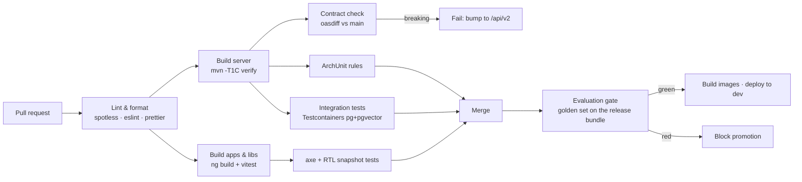

# 02 — Repository Layout & Build Topology

Single repository (`albaraka-ai`), trunk-based development, one CI pipeline. A monorepo is chosen
because the API contract, the database schema, the prompts and both UIs must evolve together and be
reviewed in one pull request — splitting them would make "change a prompt and see it in the UI"
cross-repository.

## 1. Tree

```
albaraka-ai/
├── README.md
├── docs/                                  ← this design documentation
│   ├── 00…13-*.md
│   ├── glossary-trilingual.md
│   └── adr/ADR-00x-*.md
├── specs/                                 ← machine-readable contracts (source of truth)
│   ├── openapi.yaml                       (68 paths · 81 operations · 86 schemas)
│   ├── asyncapi.yaml                      (SSE + internal job events)          ← Phase 1
│   ├── db/
│   │   ├── schema.sql                     (reference DDL: 58 objects, 35 enums, 246 statements)
│   │   ├── seed/                          ← GENERATED by tools/seed-gen; do not edit by hand
│   │   │   ├── V900__seed_glossary.sql    (9 collections, 97 glossary terms)
│   │   │   ├── V901__seed_prompts.sql     (10 prompt templates + versions, all DRAFT)
│   │   │   ├── V902__seed_policies.sql    (10 guardrail policies, 99 messages, 6 registers)
│   │   │   ├── V903__seed_dialect.sql     (366 Derja → MSA mappings)
│   │   │   └── README.md
│   │   └── tests/
│   │       ├── schema_test.sql            (G1 gate · G2 audit chain · G3 two-eyes · G4 FTS: 26 assertions)
│   │       └── seed_test.sql              (G5 glossary/dialect · G6 prompts · G7 policies: 23 assertions)
│   ├── prompts/                           (canonical prompt sources, imported by V901)
│   │   ├── README.md                      (the front-matter contract V901 implements)
│   │   ├── system.assistant.fr.md
│   │   ├── system.assistant.ar.md
│   │   ├── system.assistant.en.md
│   │   ├── guardrail.sharia.judge.md
│   │   ├── utility.prompts.md             (6 prompts: classifier, rewrite, reranker, contract, summarizer, judge)
│   │   └── templates.refusals.yaml        (REF-01…REF-06 trilingual + disclaimers + follow-up pools)
│   ├── i18n/
│   │   ├── README.md
│   │   ├── normalization.json             (8-stage pipeline · FTS parser mapping · number formats)
│   │   └── derja-msa.json                 (366 mappings + 289 shared-vocabulary entries)
│   ├── eval/
│   │   ├── README.md
│   │   ├── kb-manifest.jsonl              (48 chunks / 16 documents, incl. retired and quarantined)
│   │   ├── golden-set.jsonl               (100 cases, trilingual)
│   │   └── red-team.jsonl                 (RT-01…RT-15)
│   ├── keycloak/
│   │   ├── README.md
│   │   └── albaraka-realm.json            (5 clients, 9 governance roles, structural MFA)
│   └── config/
│       ├── README.md                      (what belongs in YAML, what belongs in the database)
│       ├── application.yaml               (shared base: wiring + first-boot seeds)
│       └── application-{dev,uat,prod}.yaml
├── server/                                ← Spring Boot 4 / Java 21 (Maven multi-module)   ← Phase 1
│   ├── pom.xml                            (parent: BOM, plugins, versions)
│   ├── mvnw  mvnw.cmd  .mvn/
│   ├── assistant-domain-shared/           (value objects: Locale, DocStatus, Classification…)
│   ├── assistant-infra/                   (Groq, Google, pgvector, S3, Redis, mail adapters)
│   ├── assistant-identity/
│   ├── assistant-audit/
│   ├── assistant-knowledge/
│   ├── assistant-ingestion/
│   ├── assistant-guardrails/
│   ├── assistant-rag/
│   ├── assistant-governance/
│   ├── assistant-analytics/
│   ├── assistant-api/                     (REST + SSE controllers for both facades)
│   ├── assistant-boot/                    (composition root, Flyway, config, SeedOnEmptyDatabaseRunner)
│   └── assistant-eval/                    (evaluation harness; runs the golden set)
├── apps/                                                                    ← Phase 1
│   ├── frontoffice-web/                   (Angular 22 SPA + widget build target)
│   └── backoffice-web/                    (Angular 22 SPA)
├── libs/                                                                    ← Phase 1
│   ├── shared-ui/                         (Angular library: chat, RTL shell, tables, steppers)
│   ├── shared-contracts/                  (generated TS types + API client from openapi.yaml)
│   └── shared-i18n/                       (locale dictionaries, Derja↔MSA maps, bidi utils)
├── deploy/                                                                  ← Phase 1
│   ├── docker-compose.yml                 (local/dev topology)
│   ├── docker/                            (Dockerfiles: server, web, keycloak theme)
│   ├── k8s/                               (manifests / Helm chart — Phase 5)
│   └── nginx/                             (edge config, CORS, rate limits)
├── tools/                                 ← every one is a CI gate; each linter ships a mutation
│   │                                        self-test proving it can fail
│   ├── seed-gen/                          (generates specs/db/seed from the authored sources)
│   ├── db-verify/                         (runs schema.sql + seeds against a throwaway PostgreSQL)
│   ├── prompt-lint/                       (9 groups · 33 mutations)
│   ├── eval-lint/                         (13 groups · 39 mutations)
│   ├── realm-lint/                        (8 groups · 47 mutations)
│   ├── config-lint/                       (12 groups · 103 mutations)
│   ├── i18n-lint/                         (24 groups · 77 mutations)
│   ├── spike/                             (dependency smoke tests, no build required)  ← Phase 1
│   ├── codegen/                           (openapi → TS/Java generation scripts)       ← Phase 1
│   └── kb-import/                         (bulk import of the bank's existing content) ← Phase 1
├── .github/workflows/                     (ci.yml, eval-gate.yml, release.yml)           ← Phase 1
├── .editorconfig  .gitignore  .gitattributes                                            ← Phase 1
├── Makefile                               (make dev, make test, make eval, make gen)     ← Phase 1
└── CHANGELOG.md                                                                           ← Phase 1
```

Entries marked **← Phase 1** are planned and do not exist yet. Everything unmarked exists in the
repository today and is kept honest by a gate in `tools/`: `db-verify` executes the schema and the
seeds against a real PostgreSQL, and each linter validates one contract against the documents it is
derived from. A tree that lists files which do not exist is the same class of defect as a code
snippet that does not compile — it is read as a promise.

## 2. Naming & coding conventions

| Area | Convention |
|---|---|
| Java package root | `tn.albaraka.ai` |
| Java module prefix | `assistant-` |
| REST base path | `/api/v1` (public), `/api/v1/admin` (backoffice) |
| DB objects | `snake_case`, singular table names, `idx_<table>_<cols>`, `fk_<table>_<ref>` |
| Angular | standalone components, `*.component.ts`, signal inputs (`input.required<T>()`), no `NgModule` |
| Locale codes | `fr-FR`, `ar-TN`, `en-GB` (BCP-47, used end-to-end: HTTP → JWT → DB → UI) |
| Git branches | `feat/…`, `fix/…`, `chore/…`, `docs/…` off `main`; squash merges |
| Commits | Conventional Commits (drives CHANGELOG) |
| IDs | UUIDv7 for all entities (time-ordered → better index locality than UUIDv4) |
| Money | `BigDecimal` + ISO currency `TND`; never `double` |

## 3. Maven parent — pinned versions

```xml
<properties>
  <java.version>21</java.version>
  <spring-boot.version>4.1.1</spring-boot.version>
  <spring-ai.version>2.0.0</spring-ai.version>   <!-- requires Boot 4 -->
  <postgresql.version>17</postgresql.version>
  <pgvector.version>0.8.1</pgvector.version>
  <flyway.version>11.x</flyway.version>
  <archunit.version>1.4.x</archunit.version>
  <testcontainers.version>1.21.x</testcontainers.version>
  <jjwt.version>0.13.x</jjwt.version>
</properties>
```

Key starters in `assistant-infra`:

| Starter | Used for |
|---|---|
| `spring-ai-starter-model-openai` | Groq chat completions (`base-url=https://api.groq.com/openai/v1`) |
| `spring-ai-starter-model-google-genai` | `gemini-embedding-001` embeddings |
| `spring-ai-starter-vector-store-pgvector` | pgvector `VectorStore` (customised for hybrid search) |
| `spring-boot-starter-oauth2-resource-server` | Keycloak JWT validation |
| `spring-boot-starter-data-jpa` + `flyway-core` | persistence & migrations |
| `spring-boot-starter-webflux` | `WebClient` for provider calls + SSE support |
| `spring-boot-starter-actuator` + `micrometer-tracing-bridge-otel` | health, metrics, tracing |
| `spring-boot-starter-validation` | bean validation |

> **Groq through Spring AI**: Groq has no first-party starter; it is OpenAI-compatible, so the
> OpenAI starter is pointed at Groq's base URL. Two Groq quirks to respect: no multimodal messages,
> and some OpenAI parameters are ignored/rejected (`logprobs`, `n>1`, `presence_penalty` on some
> models). These are handled by a `GroqChatOptionsSanitizer` in `assistant-infra`.
>
> **Second Groq client for the guard models**: `llama-guard-4-12b` and `llama-prompt-guard-2-86m`
> are declared as separate named `ChatModel` beans (`guardModel`, `promptGuardModel`) so the primary
> and moderation paths have independent timeouts, rate limits and circuit breakers.

## 4. Angular workspace

```jsonc
// angular.json (abridged)
{
  "projects": {
    "frontoffice-web": { "architect": { "build": { "configurations": {
        "production-fr": {}, "production-ar": {}, "production-en": {} } } } },
    "backoffice-web":  { },
    "shared-ui":       { "projectType": "library" },
    "shared-contracts":{ "projectType": "library" },
    "shared-i18n":     { "projectType": "library" }
  }
}
```

* **One build, three locales at runtime** (dictionaries lazy-loaded per locale) — avoids 3× build
  matrices and allows instant language switching with RTL flip. Rationale in
  [`06-i18n-trilingual-rtl.md`](06-i18n-trilingual-rtl.md) §3.
* `frontoffice-web` has a second build target `widget` producing a single self-contained
  `albaraka-assistant.js` + shadow-DOM styles for embedding on the bank's public site.
* Dev-server proxy (`proxy.conf.json`) forwards `/api` and `/auth` to the backend and Keycloak so
  the browser only ever talks to one origin (no CORS in dev, no hard-coded hosts).

## 5. CI pipeline



The **evaluation gate** is what makes "admins can polish the assistant" safe: any change to prompts,
retrieval config, guardrail policy or KB content produces a *release bundle* that must pass the
golden set before promotion — see [`11-quality-evaluation.md`](11-quality-evaluation.md).

## 6. Local development

```bash
make dev            # docker compose up postgres+pgvector, redis, keycloak, minio
make seed           # flyway migrate + seed glossary/prompts/policies + import demo KB
make server         # ./mvnw -pl assistant-boot spring-boot:run -Dspring.profiles.active=local
make web            # ng serve frontoffice-web  (proxy → :8080)
make admin          # ng serve backoffice-web   (proxy → :8080)
make eval           # run the golden set against the local backend and print the scorecard
make spike          # tools/spike: verify Groq + Google keys work end-to-end
```

Until the `Makefile` lands, the specification gates are run directly. These are the commands CI runs,
and they need nothing but Node ≥ 20 (plus a throwaway PostgreSQL for `db-verify`, which downloads its
own):

```bash
node tools/seed-gen/generate.mjs --check     # specs/db/seed matches its sources; boundary audit
cd tools/db-verify && npm run verify         # schema.sql + schema_test.sql   → 26 assertions
cd tools/db-verify && npm run verify:seed    # schema + all four seeds + seed_test.sql → 23 assertions
for t in prompt eval realm config i18n; do node tools/$t-lint/lint.mjs; done
for t in prompt eval realm config i18n; do node tools/$t-lint/self-test.mjs; done
```

`generate.mjs --check` must run before `verify:seed`: the seed tests prove the SQL is well-formed and
obeys the invariants, but only the staleness check proves the SQL is the SQL the documents imply.

Required local secrets (`.env`, git-ignored; `.env.example` committed):

```
GROQ_API_KEY=…                 # LLM + moderation models
GOOGLE_API_KEY=…               # gemini-embedding-001
KEYCLOAK_ADMIN=… / KEYCLOAK_ADMIN_PASSWORD=…
POSTGRES_PASSWORD=…
```

With no keys, the `local-mock` profile boots the backend against deterministic stub adapters
(`MockChatModel`, `HashingEmbeddingModel`) so UI and workflow development never depends on a paid
API — this is also what CI uses.

## 7. What is deliberately *not* in the repo

* No committed API keys, ever (pre-commit secret scanning with `gitleaks`).
* No customer data, no real document content: `specs/db/seed` contains only the trilingual glossary,
  prompt templates, policies and 12 synthetic sample documents.
* No generated code (`shared-contracts` TS types, Spring OpenAPI stubs) — generated in CI,
  cached as build artifacts.
* No `node_modules`, no Maven `target/`, no Docker volumes.
