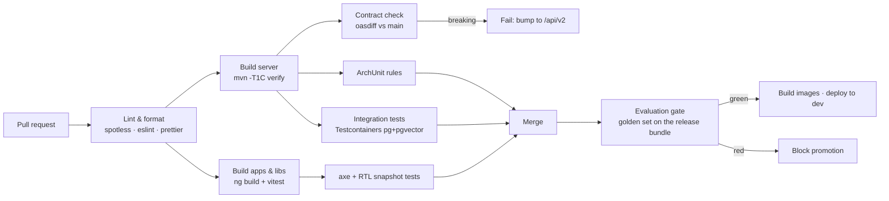

# 02 — Repository Layout & Build Topology

Single repository (`albaraka-ai`), trunk-based development, one CI pipeline. A monorepo is chosen
because the API contract, the database schema, the prompts and both UIs must evolve together and be
reviewed in one pull request — splitting them would make "change a prompt and see it in the UI"
cross-repository.

## 1. Tree

```
albaraka-ai/
├── README.md
├── docs/                                  ← this design documentation
│   ├── 00…13-*.md
│   ├── glossary-trilingual.md
│   └── adr/ADR-00x-*.md
├── specs/                                 ← machine-readable contracts (source of truth)
│   ├── openapi.yaml
│   ├── asyncapi.yaml                      (SSE + internal job events)
│   ├── db/
│   │   ├── schema.sql                     (reference DDL, kept in sync with Flyway)
│   │   └── seed/
│   │       ├── V900__seed_glossary.sql
│   │       ├── V901__seed_prompts.sql
│   │       └── V902__seed_policies.sql
│   ├── keycloak/albaraka-realm.json
│   ├── prompts/                           (canonical prompt sources, imported into DB)
│   │   ├── system.assistant.fr.md
│   │   ├── system.assistant.ar.md
│   │   ├── system.assistant.en.md
│   │   ├── guardrail.sharia.md
│   │   └── templates.refusals.yaml
│   ├── eval/golden-set.jsonl
│   └── config/application-{dev,uat,prod}.yaml
├── server/                                ← Spring Boot 4 / Java 21 (Maven multi-module)
│   ├── pom.xml                            (parent: BOM, plugins, versions)
│   ├── mvnw  mvnw.cmd  .mvn/
│   ├── assistant-domain-shared/           (value objects: Locale, DocStatus, Classification…)
│   ├── assistant-infra/                   (Groq, Google, pgvector, S3, Redis, mail adapters)
│   ├── assistant-identity/
│   ├── assistant-audit/
│   ├── assistant-knowledge/
│   ├── assistant-ingestion/
│   ├── assistant-guardrails/
│   ├── assistant-rag/
│   ├── assistant-governance/
│   ├── assistant-analytics/
│   ├── assistant-api/                     (REST + SSE controllers for both facades)
│   ├── assistant-boot/                    (composition root, Flyway, config, main class)
│   └── assistant-eval/                    (evaluation harness; runs the golden set)
├── apps/
│   ├── frontoffice-web/                   (Angular 22 SPA + widget build target)
│   └── backoffice-web/                    (Angular 22 SPA)
├── libs/
│   ├── shared-ui/                         (Angular library: chat, RTL shell, tables, steppers)
│   ├── shared-contracts/                  (generated TS types + API client from openapi.yaml)
│   └── shared-i18n/                       (locale dictionaries, Derja↔MSA maps, bidi utils)
├── deploy/
│   ├── docker-compose.yml                 (local/dev topology)
│   ├── docker/                            (Dockerfiles: server, web, keycloak theme)
│   ├── k8s/                               (manifests / Helm chart — Phase 5)
│   └── nginx/                             (edge config, CORS, rate limits)
├── tools/
│   ├── spike/                             (dependency smoke tests, no build required)
│   ├── codegen/                           (openapi → TS/Java generation scripts)
│   └── kb-import/                         (bulk import of the bank's existing content)
├── .github/workflows/                     (ci.yml, eval-gate.yml, release.yml)
├── .editorconfig  .gitignore  .gitattributes
├── Makefile                               (make dev, make test, make eval, make gen)
└── CHANGELOG.md
```

## 2. Naming & coding conventions

| Area | Convention |
|---|---|
| Java package root | `tn.albaraka.ai` |
| Java module prefix | `assistant-` |
| REST base path | `/api/v1` (public), `/api/v1/admin` (backoffice) |
| DB objects | `snake_case`, singular table names, `idx_<table>_<cols>`, `fk_<table>_<ref>` |
| Angular | standalone components, `*.component.ts`, signal inputs (`input.required<T>()`), no `NgModule` |
| Locale codes | `fr-FR`, `ar-TN`, `en-GB` (BCP-47, used end-to-end: HTTP → JWT → DB → UI) |
| Git branches | `feat/…`, `fix/…`, `chore/…`, `docs/…` off `main`; squash merges |
| Commits | Conventional Commits (drives CHANGELOG) |
| IDs | UUIDv7 for all entities (time-ordered → better index locality than UUIDv4) |
| Money | `BigDecimal` + ISO currency `TND`; never `double` |

## 3. Maven parent — pinned versions

```xml
<properties>
  <java.version>21</java.version>
  <spring-boot.version>4.1.1</spring-boot.version>
  <spring-ai.version>2.0.0</spring-ai.version>   <!-- requires Boot 4 -->
  <postgresql.version>17</postgresql.version>
  <pgvector.version>0.8.1</pgvector.version>
  <flyway.version>11.x</flyway.version>
  <archunit.version>1.4.x</archunit.version>
  <testcontainers.version>1.21.x</testcontainers.version>
  <jjwt.version>0.13.x</jjwt.version>
</properties>
```

Key starters in `assistant-infra`:

| Starter | Used for |
|---|---|
| `spring-ai-starter-model-openai` | Groq chat completions (`base-url=https://api.groq.com/openai/v1`) |
| `spring-ai-starter-model-google-genai` | `gemini-embedding-001` embeddings |
| `spring-ai-starter-vector-store-pgvector` | pgvector `VectorStore` (customised for hybrid search) |
| `spring-boot-starter-oauth2-resource-server` | Keycloak JWT validation |
| `spring-boot-starter-data-jpa` + `flyway-core` | persistence & migrations |
| `spring-boot-starter-webflux` | `WebClient` for provider calls + SSE support |
| `spring-boot-starter-actuator` + `micrometer-tracing-bridge-otel` | health, metrics, tracing |
| `spring-boot-starter-validation` | bean validation |

> **Groq through Spring AI**: Groq has no first-party starter; it is OpenAI-compatible, so the
> OpenAI starter is pointed at Groq's base URL. Two Groq quirks to respect: no multimodal messages,
> and some OpenAI parameters are ignored/rejected (`logprobs`, `n>1`, `presence_penalty` on some
> models). These are handled by a `GroqChatOptionsSanitizer` in `assistant-infra`.
>
> **Second Groq client for the guard models**: `llama-guard-4-12b` and `llama-prompt-guard-2-86m`
> are declared as separate named `ChatModel` beans (`guardModel`, `promptGuardModel`) so the primary
> and moderation paths have independent timeouts, rate limits and circuit breakers.

## 4. Angular workspace

```jsonc
// angular.json (abridged)
{
  "projects": {
    "frontoffice-web": { "architect": { "build": { "configurations": {
        "production-fr": {}, "production-ar": {}, "production-en": {} } } } },
    "backoffice-web":  { },
    "shared-ui":       { "projectType": "library" },
    "shared-contracts":{ "projectType": "library" },
    "shared-i18n":     { "projectType": "library" }
  }
}
```

* **One build, three locales at runtime** (dictionaries lazy-loaded per locale) — avoids 3× build
  matrices and allows instant language switching with RTL flip. Rationale in
  [`06-i18n-trilingual-rtl.md`](06-i18n-trilingual-rtl.md) §3.
* `frontoffice-web` has a second build target `widget` producing a single self-contained
  `albaraka-assistant.js` + shadow-DOM styles for embedding on the bank's public site.
* Dev-server proxy (`proxy.conf.json`) forwards `/api` and `/auth` to the backend and Keycloak so
  the browser only ever talks to one origin (no CORS in dev, no hard-coded hosts).

## 5. CI pipeline



The **evaluation gate** is what makes "admins can polish the assistant" safe: any change to prompts,
retrieval config, guardrail policy or KB content produces a *release bundle* that must pass the
golden set before promotion — see [`11-quality-evaluation.md`](11-quality-evaluation.md).

## 6. Local development

```bash
make dev            # docker compose up postgres+pgvector, redis, keycloak, minio
make seed           # flyway migrate + seed glossary/prompts/policies + import demo KB
make server         # ./mvnw -pl assistant-boot spring-boot:run -Dspring.profiles.active=local
make web            # ng serve frontoffice-web  (proxy → :8080)
make admin          # ng serve backoffice-web   (proxy → :8080)
make eval           # run the golden set against the local backend and print the scorecard
make spike          # tools/spike: verify Groq + Google keys work end-to-end
```

Required local secrets (`.env`, git-ignored; `.env.example` committed):

```
GROQ_API_KEY=…                 # LLM + moderation models
GOOGLE_API_KEY=…               # gemini-embedding-001
KEYCLOAK_ADMIN=… / KEYCLOAK_ADMIN_PASSWORD=…
POSTGRES_PASSWORD=…
```

With no keys, the `local-mock` profile boots the backend against deterministic stub adapters
(`MockChatModel`, `HashingEmbeddingModel`) so UI and workflow development never depends on a paid
API — this is also what CI uses.

## 7. What is deliberately *not* in the repo

* No committed API keys, ever (pre-commit secret scanning with `gitleaks`).
* No customer data, no real document content: `specs/db/seed` contains only the trilingual glossary,
  prompt templates, policies and 12 synthetic sample documents.
* No generated code (`shared-contracts` TS types, Spring OpenAPI stubs) — generated in CI,
  cached as build artifacts.
* No `node_modules`, no Maven `target/`, no Docker volumes.
