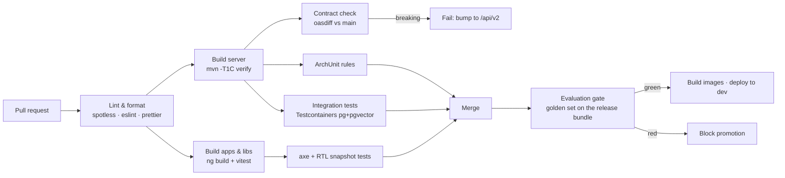

# 02 — Repository Layout & Build Topology

Single repository (`albaraka-ai`), trunk-based development, one CI pipeline. A monorepo is chosen
because the API contract, the database schema, the prompts and both UIs must evolve together and be
reviewed in one pull request — splitting them would make "change a prompt and see it in the UI"
cross-repository.

> **Architecture (2026-09-03) — ADR-009:** `server` is **Spring Boot 4.1 / Java 21** and the
> RAG pipeline is a **dedicated Python service (`rag-assistant`, FastAPI + LangChain 1.x)**.
> Both run on the host via `deploy/docker-compose.yml` (§1.a). The earlier Node parity backend
> is preserved under `legacy/node-parity/` as a reference implementation only.

## 1. Tree (real files only)

```
albaraka-ai/
├── README.md  Makefile  .gitignore  .env.example  .editorconfig  .gitattributes
├── docs/                                    ← design documentation
│   ├── 00…13-*.md  glossary-trilingual.md
│   └── adr/ADR-00x-*.md                     (008 docker-compose · 009 python-rag-service)
├── specs/                                   ← machine-readable contracts (source of truth)
│   ├── openapi.yaml  asyncapi.yaml
│   ├── db/schema.sql  db/seed/**  db/tests/**
│   ├── prompts/**  i18n/**  eval/**  keycloak/**  config/**
├── server/                                  ⟨Spring Boot 4.1 · Java 21 · Maven multi-module⟩
│   ├── pom.xml  mvnw  mvnw.cmd  .mvn/
│   ├── assistant-domain-shared/             (enums, value objects, refusal codes)
│   ├── assistant-api/                       (REST + SSE controllers, DTOs)
│   ├── assistant-identity/                  (Keycloak JWT → authorities)
│   ├── assistant-knowledge/                 (documents, versions, chunks, publish txn)
│   ├── assistant-ingestion/                 (job queue, intake API)
│   ├── assistant-governance/                (two-eyes, fatwa requests)
│   ├── assistant-analytics/  assistant-audit/
│   ├── assistant-rag-client/                (internal RAG contract HTTP client + SSE pass-through)
│   ├── assistant-boot/                      (composition root, Flyway, dev login profile)
│   └── assistant-eval/                      (JUnit golden gate)
├── rag-assistant/                           ⟨Python 3.12 · FastAPI · LangChain 1.x⟩
│   ├── pyproject.toml  README.md  Dockerfile
│   ├── src/rag_assistant/
│   │   ├── main.py  config.py  models.py  pipeline.py  retrieval.py
│   │   ├── guardrails.py  refusals.py  providers.py  seed_demo.py
│   └── tests/                               (pytest — the golden gate now lives here)
├── apps/                                    ⟨Angular 22 workspace⟩
│   ├── package.json  angular.json  tsconfig.json  proxy.conf.json  README.md
│   └── projects/
│       ├── frontoffice-web/                 (public chat — :4200 dev / / in nginx)
│       ├── backoffice-web/                  (admin — :4201 dev / /admin)
│       └── shared-ui/                       (design tokens, i18n, md→HTML)
├── legacy/
│   └── node-parity/                         ← previous Node backend (reference only)
├── deploy/
│   ├── docker-compose.yml  README.md        (full app: pgvector, redis, keycloak, minio,
│   │                                         server, rag-assistant, both SPAs, nginx)
│   ├── docker/Dockerfile.server  Dockerfile.rag-assistant  Dockerfile.frontoffice-web
│   │    Dockerfile.backoffice-web
│   ├── nginx/nginx.conf  (edge: / · /admin · /api SSE)  keycloak-theme/
│   ├── postgres/init/  (01-extensions.sql · 10-keycloak-db.sql)
│   ├── runbooks/                            (13 runbooks — updated for the two services)
│   └── k8s/  (manifests/Helm — Phase 5 target)
├── tools/                                   ← every one is a CI gate; each linter ships a
│   │                                          mutation self-test proving it can fail
│   ├── seed-gen/  db-verify/  prompt-lint/  eval-lint/  realm-lint/  config-lint/
│   ├── i18n-lint/  asyncapi-lint/  compose-lint/  spike/
│   └── (kb-import & codegen: planned)
├── .github/workflows/                       (ci.yml, eval-gate.yml, release.yml)
```

**Governance boundary (why the tree looks like this):** `server` owns every write that matters
(documents, chunks flags, reviews, audit). `rag-assistant` owns every model call and writes
**only** through `POST /v1/rag/ingest/complete` with `published=false, sharia_approved=false`.
See [ADR-009](adr/ADR-009-python-rag-service.md).

## 2. Naming & coding conventions

Both runtimes follow one convention set:

| Area | Convention |
|---|---|
| Java package root | `tn.albaraka.ai` |
| Java module prefix | `assistant-` |
| Python package | `rag_assistant` (src layout) |
| REST base path | `/api/v1` (public), `/api/v1/admin` (backoffice) |
| DB objects | `snake_case`, singular table names, `idx_<table>_<cols>`, `fk_<table>_<ref>` |
| Angular | standalone components, signal inputs, no `NgModule` |
| Locale codes | `fr-FR`, `ar-TN`, `en-GB` (BCP-47, used end-to-end: HTTP → JWT → DB → UI) |
| Git branches | `feat/…`, `fix/…`, `chore/…`, `docs/…` off `main`; squash merges |
| Commits | Conventional Commits (drives CHANGELOG) |
| IDs | UUIDv7 for all entities (time-ordered → better index locality than UUIDv4) |
| Money | ISO currency `TND`; never `double` |

## 3. Pinned versions

### 3.1 Server (Maven parent)

```xml
<properties>
  <java.version>21</java.version>
  <spring-boot.version>4.1.0</spring-boot.version>   <!-- GA 2026-06-10 -->
  <spring-framework.version>7.0.x</spring-framework.version>
  <postgresql.version>17</postgresql.version>
  <pgvector.version>0.8.1</pgvector.version>
  <flyway.version>11.x</flyway.version>
  <archunit.version>1.4.x</archunit.version>
  <testcontainers.version>1.21.x</testcontainers.version>
  <jjwt.version>0.13.x</jjwt.version>
</properties>
```

Key starters in the server (model adapters intentionally absent — ADR-009):

| Starter | Used for |
|---|---|
| `spring-boot-starter-webflux` | WebClient to `rag-assistant` + SSE server responses |
| `spring-boot-starter-oauth2-resource-server` | Keycloak JWT validation |
| `spring-boot-starter-data-jdbc` / `flyway-core` | persistence & migrations |
| `spring-boot-starter-actuator` + `micrometer-tracing-bridge-otel` | health, metrics, tracing |
| `spring-boot-starter-validation` | bean validation |
| `spring-boot-starter-cache` + `data-redis` | conversation cache, rate-limit counters |
| `springdoc-openapi-starter-webmvc-ui` | contract verification |

> Spring AI is **not** used server-side: all model-bound work is in `rag-assistant`
> (ADR-009). Spring AI 2.0 requires Boot 4+, but the Java side needs no AI library at all.

### 3.2 RAG service (Python)

```toml
[project]
requires-python = ">=3.11"
dependencies = [
  "fastapi>=0.115", "uvicorn[standard]>=0.30",
  "langchain>=1.0", "langchain-core>=1.0", "langchain-postgres>=0.0.17",
  "langchain-groq>=0.3", "langchain-google-genai>=2.0,<2.5",
  "pgvector>=0.3", "psycopg[binary]>=3.2", "sqlalchemy>=2.0",
  "pydantic>=2.9", "pydantic-settings>=2.5", "numpy>=2.0", "redis>=5"
]
```

> **Why `langchain-postgres` (PGVectorStore) not `langchain-community` PGVector**: the official
> package is the modern path with pooling (`PGEngine`), native async and **hybrid vector + BM25**
> search. `rag-assistant` still supports `RAG_VECTOR_BACKEND=mock` (deterministic cosine over the
> demo KB, no paid calls) for the demo compose profile and CI.

## 4. Angular workspace (executed)

```jsonc
// apps/angular.json (abridged)
{
  "projects": {
    "frontoffice-web": { "architect": { "serve": { "options": {
        "port": 4200, "host": "0.0.0.0", "proxyConfig": "proxy.conf.json", "allowedHosts": true } } } },
    "backoffice-web":  { "architect": { "serve": { "options": {
        "port": 4201, "host": "0.0.0.0", "proxyConfig": "proxy.conf.json", "allowedHosts": true } } } },
    "shared-ui":       { "projectType": "library" }
  }
}
```

* **One build, three locales at runtime** (dictionaries live in `shared-ui` and switch instantly
  with the RTL flip; the `<html>` `lang`/`dir` attributes follow the selected locale). Rationale in
  [`06-i18n-trilingual-rtl.md`](06-i18n-trilingual-rtl.md) §3.
* `shared-contracts` (generated TS types) and the `widget` build target for the embedded assistant
  are later additions; the demo workspace ships `shared-ui` only.
* Dev-server proxy (`proxy.conf.json`) forwards `/api` to the backend on `:9002`, so the browser
  only ever talks to one origin (no CORS in dev, no hard-coded hosts). `allowedHosts: true` is set
  for sandbox preview hosting only and must be removed for production builds.

## 5. CI pipeline



The **evaluation gate** is what makes "admins can polish the assistant" safe: any change to prompts,
retrieval config, guardrail policy or KB content produces a *release bundle* that must pass the
golden set before promotion — see [`11-quality-evaluation.md`](11-quality-evaluation.md).

## 6. Local development

### 6.1 Your host (docker compose — the deliverable)

```bash
cp .env.example .env                # keys optional: demo runs in mock mode
make up                             # docker compose up -d --build
make down                           # docker compose down
# → web UI:        http://localhost:9000          (frontoffice)
# → admin console: http://localhost:9000/admin    (backoffice)
# → API health:    http://localhost:9002/actuator/health/liveness
# → RAG health:    http://localhost:9003/v1/rag/health
# → Keycloak:      http://localhost:9001
```

Services: `postgres` (pgvector/pgvector:pg17), `redis`, `keycloak`, `minio`, `rag-assistant`,
`server`, `web` (nginx serving both SPAs). `make up` runs Flyway migrations + demo seeds
automatically; `rag-assistant` seeds the demo KB embeddings on first boot (`mock` mode).

### 6.2 Sandbox / CI (no Docker required)

`tools/db-verify` + `tools/*-lint` still run on Node ≥ 20 only. The RAG golden gate runs as
pytest in `rag-assistant/` (`RAG_PROVIDER_MODE=mock` + vector backend `mock`), using the same
8-case assertions previously gated by the Node harness:

```bash
cd rag-assistant && python -m pytest           # golden gate (mock mode, no keys needed)
cd tools/db-verify && npm run verify           # schema.sql + schema_test.sql → 26 assertions
cd tools/db-verify && npm run verify:seed      # + seeds + seed_test.sql    → 23 assertions
node tools/seed-gen/generate.mjs --check
for t in prompt eval realm config i18n; do node tools/$t-lint/lint.mjs; node tools/$t-lint/self-test.mjs; done
cd tools/asyncapi-lint && npm run verify
cd tools/compose-lint && npm run verify        # docker-compose.yml vs docs/12 §2.2 + ADR-008
```

`generate.mjs --check` must run before `verify:seed`: the seed tests prove the SQL is well-formed
and obey the invariants, but only the staleness check proves the SQL is the SQL the documents
imply.

## 7. What is deliberately *not* in the repo

* No committed API keys, ever (pre-commit secret scanning with `gitleaks`).
* No customer data, no real document content: `specs/db/seed` contains only the trilingual glossary,
  prompt templates, policies and 12 synthetic sample documents.
* No generated code (`shared-contracts` TS types, Spring OpenAPI stubs) — generated in CI,
  cached as build artifacts.
* No `node_modules`, no Maven `target/`, no Docker volumes.
