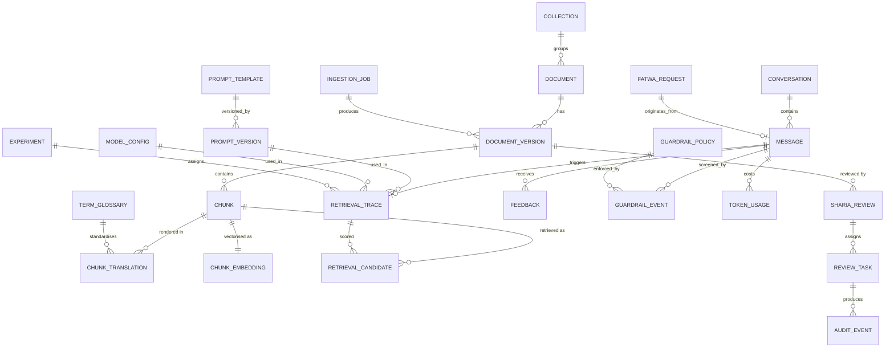

# 03 — Data Model

PostgreSQL 17 with `pgvector` 0.8.1, `pg_trgm`, `unaccent`. One schema `albaraka_ai`.
Executable DDL: [`specs/db/schema.sql`](../specs/db/schema.sql). Migrations via Flyway.

## 1. Entity-relationship overview



## 2. Knowledge domain

### 2.1 `collection`
Logical grouping used for retrieval scoping and admin navigation.

| Column | Type | Notes |
|---|---|---|
| `id` | uuid pk | UUIDv7 |
| `code` | text unique | `PRODUCTS_RETAIL`, `PRODUCTS_CORPORATE`, `SHARIA_PRINCIPLES`, `PROCEDURES`, `TARIFFS`, `FAQ`, `DIGITAL_CHANNELS`, `REGULATION` |
| `name_fr` / `name_ar` / `name_en` | text | trilingual labels |
| `default_audience` | enum `PUBLIC, AGENT, INTERNAL` | |
| `default_classification` | enum `PUBLIC, INTERNAL, CONFIDENTIAL, RESTRICTED` | |

### 2.2 `document`
The *thing* (a product sheet, the tariff booklet, a committee opinion). Immutable identity.

| Column | Type | Notes |
|---|---|---|
| `id` | uuid pk | |
| `collection_id` | uuid fk | |
| `external_ref` | text | bank document reference (e.g. `CB-2026-TARIFS`) |
| `title_fr` / `title_ar` / `title_en` | text | at least one required |
| `source_uri` | text | S3 key of the original file |
| `mime_type`, `size_bytes`, `sha256` | | integrity + de-duplication |
| `source_lang` | locale | language of the original |
| `classification` | enum | see §6 |
| `audience` | enum | who may retrieve it |
| `product_codes` | text[] | `MOURABAHA`, `IJARA`, `MOUCHARAKA`, `MOUDHARABA`, `MOUSSAWAMA`, `SALAM`, `ISTISNAA`, `WAKALA`, `DEPOSIT_INVESTMENT`, `DEPOSIT_CURRENT` |
| `valid_from`, `valid_to` | timestamptz | **temporal validity** — a superseded tariff booklet stops being retrievable on its `valid_to` |
| `current_version_id` | uuid fk | points at the live version |
| `lifecycle_state` | enum | `DRAFT, IN_REVIEW, SHARIA_APPROVED, PUBLISHED, DEPRECATED, RETIRED` |
| `owner_role` | text | accountable business unit |
| `created_by/at`, `updated_by/at` | | |

### 2.3 `document_version`
Content is versioned, never mutated in place. Republishing creates v+1; old chunks stop being
retrievable but remain for audit and answer-replay.

| Column | Type | Notes |
|---|---|---|
| `id` | uuid pk | |
| `document_id` | uuid fk | |
| `version_no` | int | unique per document |
| `body_text` | text | normalised plain text (markdown preserved) |
| `body_lang` | locale | |
| `change_summary_fr/ar/en` | text | what changed, shown to reviewers |
| `state` | enum | same lifecycle enum, per version |
| `sharia_review_id` | uuid fk nullable | |
| `published_at`, `published_by` | | |
| `version` | int | JPA optimistic lock |

### 2.4 `chunk`
The retrieval unit.

| Column | Type | Notes |
|---|---|---|
| `id` | uuid pk | |
| `document_version_id` | uuid fk | |
| `ordinal` | int | position in the document |
| `content` | text | **the text actually embedded and shown to the model** |
| `heading_path` | text[] | `["Financement","Mourabaha","Conditions"]` — prepended to the embedding title |
| `token_count` | int | |
| `lang` | locale | language of `content` |
| `is_translation` | bool | true if machine/human-generated from a source chunk |
| `source_chunk_id` | uuid fk self | alignment link between renderings |
| `normalized_text` | text | Arabic/French normalised (diacritics stripped, alef unified, lowercased, unaccented) |
| `tsv` | tsvector generated | `to_tsvector('albaraka_fts', normalized_text)` — hybrid keyword search |
| `searchable` | bool | **materialised gate** = `state=PUBLISHED AND sharia_approved AND now() BETWEEN valid_from AND valid_to`; indexed. Retrieval always filters on it. |
| `embedding_model`, `embedding_dim` | text, int | which model produced the vector (re-index safety) |
| `embedding_status` | enum `PENDING, EMBEDDED, FAILED, STALE` | |
| `sha256` | text | content hash → skip re-embedding unchanged chunks |

**Why a materialised `searchable` flag instead of computing the predicate at query time?**
Because it is the Sharia gate: one indexed boolean, one transaction that flips it, and a DB-level
guarantee that retrieval cannot see unapproved content even if application code has a bug. The
predicate is re-evaluated by a trigger on any state/validity change (see DDL).

### 2.5 `chunk_embedding`
Separated from `chunk` so the row stays narrow and the HNSW index is built on a small table.

| Column | Type | Notes |
|---|---|---|
| `chunk_id` | uuid pk fk | |
| `embedding` | `halfvec(1536)` | `gemini-embedding-001` @ 1536 dims (Matryoshka). `halfvec` halves storage vs `vector` with negligible recall loss |
| `model`, `dim`, `task_type` | | `RETRIEVAL_DOCUMENT` |
| `created_at` | | |

Indexes: `USING hnsw (embedding halfvec_cosine_ops) WITH (m=16, ef_construction=128)` +
`SET hnsw.iterative_scan = relaxed_order` at session level so **metadata-filtered** ANN queries
still return k results. Composite b-tree on `(searchable, lang, audience)` to pre-filter cheaply.

### 2.6 `chunk_translation`
Optional human-verified alternative renderings and metadata used by the UI (e.g. Arabic title for a
French chunk).

### 2.7 `term_glossary`
The terminology backbone — see [`06-i18n-trilingual-rtl.md`](06-i18n-trilingual-rtl.md) §6.

| Column | Type | Notes |
|---|---|---|
| `id` | uuid pk | |
| `canonical_code` | text unique | `MOURABAHA` |
| `term_fr`, `term_ar`, `term_en` | text | `Mourabaha` / `مرابحة` / `Murabaha (cost-plus sale)` |
| `transliteration_ar` | text | `murābaḥa` |
| `definition_fr/ar/en` | text | short, approved |
| `forbidden_renderings` | text[] | `["prêt","crédit","loan","intérêt"]` — **must not** be used for this concept |
| `domain` | enum `PRODUCT, SHARIA, PROCEDURE, FINANCIAL, DIGITAL` |
| `sharia_sensitive` | bool | if true, edits require SHARIA_OFFICER approval |
| `status` | enum `ACTIVE, DEPRECATED` |

### 2.8 `ingestion_job` / `embedding_job`
DB-backed queue (`status`, `attempts`, `next_retry_at`, `error`, `progress`, `payload jsonb`),
consumed with `FOR UPDATE SKIP LOCKED`. No external broker in v1.

## 3. Conversation domain

### 3.1 `conversation`

| Column | Notes |
|---|---|
| `id` | uuid pk |
| `channel` | `WEB_APP`, `WIDGET`, `AGENT_DESK`, `API` |
| `principal_id` | Keycloak `sub`, null for anonymous |
| `device_id` | hashed ephemeral id for anonymous users |
| `locale` | `fr-FR` / `ar-TN` / `en-GB` (may change mid-conversation; per-message locale is stored too) |
| `state` | `ACTIVE, ARCHIVED, ESCALATED, CLOSED` |
| `handoff_ref` | ticket id when escalated to a human or to the Sharia committee |
| `pii_class` | highest classification seen in the conversation |
| `started_at`, `last_message_at` | |
| `anonymised_at` | retention: after 24 months, content is replaced by a one-way digest |

### 3.2 `message`

| Column | Notes |
|---|---|
| `id`, `conversation_id`, `ordinal` | |
| `role` | `USER, ASSISTANT, SYSTEM, TOOL, AGENT` |
| `content_raw` | as received (never sent to a provider before the egress gate) |
| `content_redacted` | what was actually sent, after PII redaction |
| `content_rendered` | final answer markdown |
| `locale`, `dir` | `ltr` / `rtl` |
| `detected_lang`, `detected_intent` | `PRODUCT_QUESTION, PRODUCT_COMPARISON, SHARIA_CONCEPT, PROCEDURE, TARIFF, BRANCH_LOCATOR, OUT_OF_SCOPE, RELIGIOUS_RULING_REQUEST, ABUSE, SMALL_TALK` |
| `citations` | jsonb `[{source_id, chunk_id, ordinal, title, url, score}]` |
| `refusal_code` | `REF-01…REF-06`, null if answered |
| `disclaimer_ids` | which standing disclaimers were attached |
| `confidence` | numeric 0–1 from the answer contract |
| `prompt_version_id`, `model_config_id`, `retrieval_config_id`, `experiment_arm` | **full reproducibility**: an answer can be replayed exactly |
| `degradation_step` | 1–5 of the ladder (§01 7.2) |
| `latency_ms`, `ttft_ms` | |
| `created_at` | |

### 3.3 `retrieval_trace` / `retrieval_candidate`
Per answer: the rewritten queries, the per-strategy result lists, RRF scores, the reranker output,
the final context and the token budget consumption. Candidates keep `(chunk_id, strategy, rank,
score, rrf_score, selected)`.

This is the single most important table for the backoffice **Retrieval Lab**: an admin can open any
customer answer and see exactly why each chunk was or was not selected.

### 3.4 `feedback`
`message_id`, `rating` (`UP, DOWN, SHARIA_CONCERN, FACTUAL_ERROR, WRONG_LANGUAGE, INCOMPLETE, OFFENSIVE`),
`free_text`, `contact_opt_in`, `status` (`NEW, TRIAGED, IN_PROGRESS, RESOLVED, DISMISSED`),
`resolution_ref` (link to the KB/prompt change that fixed it), `created_by`.
A `SHARIA_CONCERN` rating **auto-creates a review task** for a Sharia officer and blocks nothing but
is tracked to closure with an SLA.

### 3.5 `token_usage` / `llm_call_log`
Per provider call: model, tokens in/out, latency, status, cost (computed from a `model_pricing`
table so finance can be charged back), redacted request/response for audit. Aggregated nightly into
`analytics_daily`.

## 4. Configuration domain (the "polishable" surface)

### 4.1 `prompt_template` / `prompt_version`
| Column | Notes |
|---|---|
| `code` | `SYSTEM_ASSISTANT`, `SYSTEM_RERANKER`, `QUERY_REWRITE`, `INTENT_CLASSIFIER`, `GUARDRAIL_JUDGE`, `ANSWER_CONTRACT`, `SUMMARIZER` |
| `locale` | `fr-FR` / `ar-TN` / `en-GB` / `*` (locale-independent) |
| `body` | mustache/`{placeholder}` template |
| `variables` | jsonb schema of placeholders |
| `version_no`, `state` | `DRAFT, IN_REVIEW, ACTIVE, RETIRED` |
| `requires_sharia_approval` | bool, computed from a diff against religious-term lexicon + manually settable |
| `activated_at/by`, `activated_from` | which version it replaced (instant rollback) |
| `eval_snapshot` | jsonb scores obtained at activation time |

Exactly **one** `ACTIVE` version per `(code, locale)` — enforced by a partial unique index.

### 4.2 `model_config`
`code` (`CHAT_PRIMARY`, `CHAT_FAST`, `RERANKER`, `GUARD_SAFETY`, `GUARD_INJECTION`, `EMBEDDING`),
`provider` (`GROQ`, `GOOGLE`, `ONPREM`), `model_id`, `temperature`, `top_p`, `max_tokens`,
`timeout_ms`, `retry`, `fallback_config_id`, `rate_limit_per_min`, `daily_budget_usd`, `enabled`.
Versioned the same way; activation is atomic and audited.

### 4.3 `retrieval_config`
`top_k_dense`, `top_k_fts`, `top_k_trgm`, `rrf_k` (60), `min_score_dense`, `min_score_fts`,
`rerank_enabled`, `rerank_top_n`, `context_token_budget`, `mmr_lambda`, `hyde_enabled`,
`query_expansion_enabled`, `cross_lingual_enabled`, `filter_audience`, `boost_recent_days`.
One `ACTIVE` per `channel` (frontoffice can be tuned differently from agent-assist).

### 4.4 `guardrail_policy`
`code` (`PROHIBITED_TOPICS`, `NO_FATWA`, `PII_EGRESS`, `INJECTION`, `NUMERIC_CLAIMS`,
`LANGUAGE_CONSISTENCY`, `RATE_LIMIT`, `MAX_TURNS`), `enabled`, `severity`
(`BLOCK, WARN, LOG`), `params jsonb` (lexicons, thresholds, templates), `applies_to`
(`INPUT, OUTPUT, BOTH`), `version_no`, `state`, approval columns.

### 4.5 `assistant_config`
Non-versioned-but-audited key/value used by the UI: suggested questions per locale, disclaimer text
per locale, feature flags (`voice_input`, `widget_enabled`, `handoff_enabled`), max message length,
support hours, branch/agency list source.

## 5. Governance domain

### 5.1 `sharia_review` (workflow instance)
`subject_type` (`DOCUMENT_VERSION, PROMPT_VERSION, GUARDRAIL_POLICY, GLOSSARY_TERM, RETRIEVAL_CONFIG`),
`subject_id`, `risk_tier` (`T1_LOW, T2_MEDIUM, T3_HIGH`), `submitted_by`, `submitted_at`,
`state` (`PENDING, IN_REVIEW, CHANGES_REQUESTED, APPROVED, REJECTED, WITHDRAWN`),
`decision_reason_fr/ar/en`, `decision_by`, `decision_at`, `due_at` (SLA), `committee_ref`
(reference to the formal committee meeting/minutes when the decision is escalated to it).

### 5.2 `review_task`
Per-assigned-reviewer task enabling parallel review and quorum rules:
`review_id`, `assignee_role` (`SHARIA_OFFICER`, `COMPLIANCE`, `AI_ENGINEER`, `KB_EDITOR`),
`assignee_id`, `required` (bool), `decision`, `comments`, `decided_at`.
**Two-eyes invariant**: a check constraint + trigger reject a decision where
`assignee_id = submitted_by`, and require ≥ 1 `SHARIA_OFFICER` decision for `T3_HIGH`.

### 5.3 `fatwa_request`
Created when a customer asks for a religious ruling, or when a Sharia officer wants a formal opinion.
`ref`, `question_fr/ar/en`, `origin` (`CHAT, ADMIN, COMMITTEE`), `conversation_id`, `message_id`,
`state` (`OPEN, ASSIGNED, ANSWERED, PUBLISHED_AS_KB, CLOSED`), `answer_ref`, `committee_member`.
When answered, the backoffice offers a **one-click "publish as KB article"** — closing the loop from
customer question → committee opinion → approved knowledge.

## 6. Classification & retention

| Classification | Definition | May reach a model provider? | Retention |
|---|---|---|---|
| `PUBLIC` | Published on the bank's website | Yes (redacted anyway) | Indefinite (versioned) |
| `INTERNAL` | Staff procedures, not personal | Yes, with egress gate | 10 years |
| `CONFIDENTIAL` | Customer data, contracts, pricing negotiations | **No** — hard block in `EgressGuard` | 10 years (banking secrecy) |
| `RESTRICTED` | Sharia committee deliberations, audit, legal | **No** | 10 years, access-listed |

Row-level rules:
* Conversations: 24 months online, then anonymisation job replaces `content_*` with a SHA-256 digest
  and nulls free-text feedback; `anonymised_at` is set. Aggregate metrics survive.
* Audit events: **10 years, append-only** — `UPDATE`/`DELETE` blocked by trigger; each row stores
  `prev_hash` and `hash = SHA256(prev_hash || canonical_json(row))` forming a hash chain whose head
  is published daily to an out-of-band location (WORM bucket) so tampering is detectable.
* `llm_call_log`: 12 months with redacted payloads, then payload dropped and counters kept.

## 7. Indexes that matter

```sql
-- retrieval hot path
CREATE INDEX idx_chunk_searchable ON chunk USING btree (searchable, audience, lang)
       WHERE searchable;
CREATE INDEX idx_chunk_tsv        ON chunk USING gin  (tsv);
CREATE INDEX idx_chunk_trgm       ON chunk USING gin  (normalized_text gin_trgm_ops);
CREATE INDEX idx_chunk_emb_hnsw   ON chunk_embedding USING hnsw (embedding halfvec_cosine_ops)
       WITH (m = 16, ef_construction = 128);
-- conversation replay / QA
CREATE INDEX idx_message_conv     ON message (conversation_id, ordinal);
CREATE INDEX idx_message_feedback ON feedback (status, created_at DESC);
-- governance queues
CREATE INDEX idx_review_pending   ON sharia_review (state, due_at) WHERE state IN ('PENDING','IN_REVIEW');
-- audit chain verification
CREATE UNIQUE INDEX uq_audit_seq  ON audit_event (seq);
```

## 8. Postgres full-text search for Arabic and French

Stock Postgres has a `french` text-search configuration but **no Arabic stemmer**. Rather than
depend on an exotic extension, normalisation happens in the application and Postgres indexes the
result with a `simple`-based custom configuration:

```sql
CREATE TEXT SEARCH CONFIGURATION albaraka_fts (PARSER = default);
ALTER  TEXT SEARCH CONFIGURATION albaraka_fts
       ADD MAPPING FOR asciiword, word, numword, asciihword, hword WITH unaccent, simple;
ALTER  TEXT SEARCH CONFIGURATION albaraka_fts
       ADD MAPPING FOR numhword, hword_part, hword_asciipart, hword_numpart WITH unaccent, simple;
ALTER  TEXT SEARCH CONFIGURATION albaraka_fts
       ADD MAPPING FOR uint, int, float, sfloat WITH simple;
ALTER  TEXT SEARCH CONFIGURATION albaraka_fts
       ADD MAPPING FOR email, url, url_path, host, file, version WITH simple;
-- deliberately unmapped: blank, tag, entity, protocol
```

Two properties of this configuration are easy to get wrong and fail silently, so both are asserted
by the `G4` group in `specs/db/tests/schema_test.sql` (run by `tools/db-verify`):

* **There is no `arabic_word` token type.** The default parser emits 23 token types and that is not
  one of them — `ADD MAPPING FOR arabic_word` fails with `token type "arabic_word" does not exist`.
  It is also unnecessary: in a UTF-8 database Arabic text classifies as `word`, which is mapped
  `WITH unaccent, simple`. `unaccent` is a no-op on Arabic and `simple` preserves the token, so
  Arabic indexes correctly with no special handling. (Arabic is pre-normalised and light-stemmed in
  the application, as the table below describes.)
* **Every token type the parser can emit must be mapped, or its tokens are discarded without a
  warning.** A bare integer is `uint`; `int` only arises where a hyphen was read as a minus sign.
  Mapping `int` and `float` while omitting `uint` removed every plain integer from the index —
  tariff minimums and maximums, the years identifying loi n° 2016-48 and circulaire 2021-05, article
  numbers, quantities. `1500` on its own indexed to an empty tsvector, and `loi n° 2016-48 du 11 mai
  2016` indexed as `'-48' 'du' 'loi' 'mai' 'n°'`. Nothing errors; it appears only as poor recall on
  `TARIFF_FEES`, the intent whose numeric grounding is a blocking metric at 100 % (doc 11 §3).

The cluster encoding must be **UTF8**. On `SQL_ASCII` the parser classifies every non-ASCII token as
`blank` — all Arabic included — and the index holds nothing for the language most of the Sharia
corpus is written in. `G4h` asserts the encoding so the cause is named rather than inferred from a
failing Arabic test.

One limitation is kept as an explicit decision: the parser reads the hyphen in `2016-48` as a minus
sign, so the article number indexes as `-48` and a query for `48` does not match it. Splitting
hyphenated numbers belongs to the application normaliser (`specs/i18n/normalization.json`), not to
the text-search configuration. `G4e` fails loudly if that behaviour ever changes.

Pipeline (Java, `assistant-knowledge`):

| Step | French / English | Arabic |
|---|---|---|
| Unicode | NFKC, lowercase | NFKC, strip **tashkīl** (U+064B–U+0652), strip tatweel (U+0640) |
| Folding | `unaccent` (accents removed for FTS only; display text untouched) | Alef variants `أ إ آ ٱ` → `ا`؛ `ة` → `ه`؛ `ى` → `ي`؛ `ؤ` → `و`؛ `ئ` → `ي` |
| Dialect | — | Derja → MSA mapping table (`نحب`→`أريد`, `باش`→`من أجل`, `شنية`→`ما هي`, `برشة`→`كثيرا`, `فلوس`→`أموال`) — 366 seed mappings in `specs/i18n/derja-msa.json` |
| Stemming | Porter (light) | **Light stemmer** (Tashaphyne-style): strip prefixes `ال و ف ب ك ل س` and suffixes `ات ون ين ان ها هم هن ية` (one strip per side, min root length 3) |
| Synonyms | glossary expansion (`credit`→`financement`, `car loan`→`mourabaha vehicule`) | glossary expansion (`قرض`→`تمويل`, `سيارة`→`عربة/مركبة`) |

Two ordering constraints in that table are load-bearing rather than stylistic, and both are asserted
by `tools/i18n-lint`:

* **Dialect mapping runs before stemming.** A key the stemmer would alter can never be matched, and
  can land on a *different* key: `معلومات` stems to `معلوم`, which is itself an entry (fee → رسم), so
  "information" would be rewritten as "fee"; `الجاب` stems to `جاب` (he brought), so "the ATM" would
  become "he brought". `إجراءات`, `عمليات`, `متأخرات` and the definite forms `اليوم`, `الليل`, `البنك`
  all lose an affix and become unreachable. Nothing errors — the mapping simply stops happening.
* **Folding runs before dialect mapping**, and map keys are compared in folded form, so a user's
  `أ`/`إ`/`آ` and `ة`/`ه` variants still meet the table. The consequence is that an entry whose source
  and target fold to the same string is dead weight and is rejected: `جيت`/`جئت`, `بدا`/`بدأ`,
  `أنترنت`/`إنترنت`, `فايدة`/`فائدة`, `مية`/`مئة` and `دقايق`/`دقائق` are all already unified by the
  fold, and six such entries were removed from the seed for exactly that reason.

The **display** text is never modified — normalisation feeds only `chunk.normalized_text`, `chunk.tsv`
and the query-side expansion, so answers quote documents exactly as approved. `document_version`
stores `body_text` only; there is no normalised copy of approved content anywhere in the database.

## 9. Migration & re-embedding strategy

* Flyway versioned migrations `V1__…`; `specs/db/schema.sql` is generated from them for review.
* Changing the embedding model or dimension is a **blue-green** operation:
  1. add `embedding_model='gemini-embedding-001@1536'` rows alongside new `…@3072` rows
     (column `embedding_v2` or a second `chunk_embedding` partition);
  2. backfill with a throttled job honouring Google quotas;
  3. flip `retrieval_config.embedding_variant`;
  4. validate on the golden set; 5. drop the old vectors.
* Every DDL change ships with a rollback script; destructive changes require two reviewers in CI.
