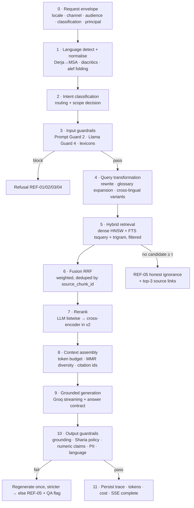
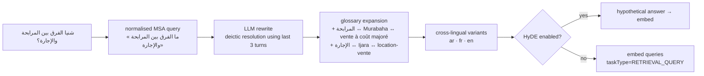

# 04 — RAG Pipeline

The pipeline is a fixed sequence of **eleven stages** implemented in `rag-assistant`
(`rag_assistant` Python package — LangChain 1.x) and called by the Spring API over the internal
RAG contract (`POST /v1/rag/chat`, docs/08 §8). Every stage is independently configurable at
runtime (`retrieval_config`, `model_config`, `guardrail_policy`), independently observable (one
OTel span, one DB trace row written by the Spring side) and independently bypassable in
degradation — except stages 3 and 10 (guardrails), which can never be disabled, only relaxed to
`WARN` by a COMPLIANCE-approved policy change. The **only** model-bound code in this repository
lives here: the Java side performs orchestration, persistence and governance only (ADR-009).

## 1. Overview



## 1.1 LangChain implementation mapping (ADR-009)

| Stage | LangChain / ecosystem component (rag_assistant) |
|---|---|
| 1 language + normalise | `langdetect`/`langid` + custom normaliser (doc 03 §8 table, Derja→MSA map) |
| 2 intent | small classifier prompt (Groq) or lexicon router — result cached |
| 3/10 guardrails | deterministic rules + prompt-based judge (`Prompt Guard 2` / `Llama Guard 4` when keys set) |
| 4 query transform | `RunnableLambda` chain (rewrite + glossary expansion, glossary from DB via `langchain`-friendly dict) |
| 5 hybrid retrieval | `langchain-postgres` **PGVectorStore** (official package, hybrid vector + BM25/tsvector, async `PGEngine`) + raw SQL trigram fallback; **mock backend** = deterministic cosine over in-memory chunk [fallback when `RAG_VECTOR_BACKEND=mock`] |
| 6 fusion | RRF in Python (pure) |
| 7 rerank | `llama-3.1-8b-instant` listwise prompt (Groq); cross-encoder in v2 |
| 8 context assembly | token-budget helper, MMR dedupe, citation ids S1..S8 |
| 9 generation | `ChatGroq` (or `chat_openai` for OpenAI-compatible) streaming with the answer-contract `ChatPromptTemplate`; deterministic `MockChatModel` when `RAG_PROVIDER_MODE=mock` |
| 11 trace | frames streamed to Spring; Spring persists (Python never writes trace rows) |

> Version pins (2026-09): `langchain >= 1.0`, `langchain-postgres >= 0.1` (PGVectorStore),
> `langchain-groq`, `langchain-google-genai` (embedding), `pgvector >= 0.7`,
> Python 3.11/3.12, FastAPI, uvicorn. See `rag-assistant/pyproject.toml`.

## 2. Stage 0 — Request envelope

Every answer is produced inside an explicit context object; nothing is inferred implicitly. The
envelope travels from the Spring API to `rag-assistant` as JSON (`POST /v1/rag/chat`, service
token, `X-RAG-Contract: 1`); the Python side rebuilds the same context as a pydantic model:

```python
class RagRequestContext(BaseModel):
    conversation_id: UUID
    message_id: UUID
    locale: str                        # fr-FR | ar-TN | en-GB (negotiated, doc 06)
    channel: str                       # WEB_APP | WIDGET | AGENT_DESK | API
    audience: str                      # PUBLIC | AGENT | INTERNAL ← from server-side JWT mapping
    max_classification: str            # highest data class allowed into retrieval
    retrieval_config: dict             # ACTIVE config resolved by the server
    prompt: dict | None                # prompt version if server pins one (else DB default)
    model: dict | None                 # model routing if server pins one
    history: list[dict]                # last ≤ 6 messages (server-truncated, redacted)
```

`audience` and `maxClassification` come from the **server-side** authority mapping — a client can
never widen its own retrieval scope. This is the mechanism that keeps internal procedures invisible
to customers and `RESTRICTED` content invisible to everyone but the audit path.

## 3. Stage 1 — Language detection & normalisation

| Task | Implementation | Notes |
|---|---|---|
| Language detection | Fast heuristic first (Unicode script ranges: Arabic block → `ar`; Latin + diacritic/stopword profile → `fr` vs `en`), LLM fallback for ambiguous short inputs | Must never call a paid model for "bonjour" |
| Arabic normalisation | Strip tashkīl (U+064B–U+0652), tatweel (U+0640); fold `أ إ آ ٱ`→`ا`, `ة`→`ه`, `ى`→`ي`, `ؤ`→`و`, `ئ`→`ي` | Applied to the *query* and to `normalized_text`, never to display text |
| French normalisation | NFKC, lowercase, `unaccent` for FTS only | Display text untouched |
| Derja → MSA | Mapping table in `shared-i18n` + DB (`derja_msa_map`), ~350 seed entries | e.g. `شنيا`→`ما هي`, `نحب`→`أريد`, `فلوس`→`أموال`, `باش`→`من أجل`, `برشة`→`كثيرا`, `قسط`→`قسط` |
| Mixed-language input | Split on script runs; detect per segment; keep the dominant language as `answer_lang` | Very common: "chnowa les conditions de la mourabaha?" |

**Answer language rule**: the answer is always produced in the language of the *question*
(`answer_lang`), independently of the language of the retrieved chunks. A French question about a
document that only exists in Arabic is answered in French, quoting the Arabic term in parentheses
when the glossary marks it as `sharia_sensitive`.

## 4. Stage 2 — Intent classification & routing

A single cheap call (`llama-3.1-8b-instant`, `temperature=0`, JSON output) — or a fine-tuned
classifier later. Intent drives routing, retrieval filters, the prompt variant and the disclaimer set.

| Intent | Examples | Retrieval scope | Special handling |
|---|---|---|---|
| `PRODUCT_QUESTION` | «ما هي شروط المرابحة؟» | `PRODUCTS_*` | product filter boost |
| `PRODUCT_COMPARISON` | «différence Mourabaha / Ijara» | `PRODUCTS_*` | forces ≥ 2 distinct products in context |
| `SHARIA_CONCEPT` | «qu'est-ce que le riba ?» | `SHARIA_PRINCIPLES` | mandatory disclaimer; no ruling |
| `RELIGIOUS_RULING_REQUEST` | «هل هذا حلال؟» «is my project halal?» | — | **REF-03 no-fatwa** + create `fatwa_request` |
| `PROCEDURE` | «comment ouvrir un compte ?» | `PROCEDURES` | step-list output format |
| `TARIFF_FEES` | «فدعوى معاليم الحساب؟» | `TARIFFS` | numeric-claim validator **strict**; `valid_to` check |
| `BRANCH_LOCATOR` | «agence à la Manouba» | `PROCEDURES`/static | structured answer from agency data |
| `DIGITAL_CHANNEL` | «e-banking / mobile app» | `DIGITAL_CHANNELS` | |
| `ACCOUNT_STATUS` | «mon solde» «RIB» | — | **REF-04** out of scope in v1 |
| `SMALL_TALK` | «bonjour», «labess?» | — | canned trilingual greeting, no retrieval, no cost |
| `OUT_OF_SCOPE` | weather, football, politics, other banks | — | **REF-06** polite redirect |
| `ABUSE` / `ADVERSARIAL` | injection, insult, jailbreak | — | **REF-01**, guardrail event, rate-limit strike |
| `COMPLAINT` | «je veux porter réclamation» | — | handoff to human + complaint ticket |

Classification output is stored on `message.detected_intent` — it is the primary axis of backoffice
analytics ("which intents fail most?").

## 5. Stage 3 — Input guardrails

Layered, cheapest-first:

1. **Structural**: length ≤ 4 000 chars, no control characters, no more than N URLs, turn count ≤ 20
   per conversation (anti-loop), rate limit per principal/device/IP (Redis token bucket).
2. **Lexicon block** (0 ms): haram-sector terms offered *as a financing request* (alcool, porc,
   jeux de hasard, armement, tabac, contenu pour adultes), conventional-interest solicitation
   («taux d'intérêt», «credit classique», «نسبة فائدة»), other-bank solicitation, political/sectarian
   content, takfir language.
3. **`meta-llama/llama-prompt-guard-2-86m`** (Groq, ~80 ms): injection/jailbreak detection on the
   raw user turn **and** on any retrieved chunk text before it enters the prompt (indirect injection
   from a poisoned document is a real vector once admins can upload content).
4. **`meta-llama/llama-guard-4-12b`** (Groq, ~150 ms): safety categories, only when 1–3 pass and the
   intent is not `SMALL_TALK`.
5. **PII gate**: detect and redact before anything leaves the bank (§7.4 of doc 01). If the message
   is *mostly* PII (e.g. a customer pasted their RIB), respond with REF-04 and never call a provider.

Guard models are separate beans with their own timeouts and circuit breakers: if a guard model is
down, policy decides — `PROHIBITED_TOPICS` and `PII_EGRESS` **fail closed** (refuse), `INJECTION`
falls back to the lexicon and logs a `WARN`.

## 6. Stage 4 — Query transformation



* **Rewrite** resolves pronouns and ellipsis against the last 3 turns ("et pour une voiture ?" →
  "quelles sont les conditions de la Mourabaha pour l'achat d'un véhicule ?").
* **Expansion** is *glossary-driven*, not free-form: only `term_glossary` synonyms are added, so a
  Sharia officer controls the vocabulary. Free synonym generation is explicitly forbidden — an LLM
  inventing a synonym for a religious term is a governance incident.
* **Cross-lingual variants**: because `gemini-embedding-001` is a single multilingual space, the
  Arabic query alone already retrieves French chunks. The variants are a *recall safety net* and are
  only issued when the first pass returns < 3 candidates above `τ_dense` (cost control).
* **HyDE** is off by default; it measurably helps long conceptual questions and hurts short factual
  ones. It is an A/B-able flag in `retrieval_config`.
* **Embeddings** are batched (one call, ≤ 100 texts) with `taskType=RETRIEVAL_QUERY` — asymmetric
  task types are mandatory for Google's models; using `RETRIEVAL_DOCUMENT` on queries degrades recall.

## 7. Stage 5 — Hybrid retrieval

Three complementary strategies, all metadata-filtered by the **materialised `searchable` gate**:

```sql
SET LOCAL hnsw.iterative_scan = relaxed_order;   -- keep k results despite filters
SET LOCAL hnsw.ef_search = 80;

WITH params AS (
  SELECT :qvec::halfvec(1536) AS qvec,
         :tsq::tsquery        AS tsq,
         :trgm                AS trgm,
         :langs               AS langs,      -- answer_lang + cross-lingual set
         :audience            AS audience,
         :products            AS products
),
dense AS (
  SELECT c.id, c.document_version_id, 1 - (e.embedding <=> p.qvec) AS score, 'DENSE'::text AS strategy
  FROM chunk c JOIN chunk_embedding e ON e.chunk_id = c.id, params p
  WHERE c.searchable AND c.lang = ANY(p.langs) AND c.audience_allowed && p.audience
    AND (p.products IS NULL OR c.product_codes && p.products)
  ORDER BY e.embedding <=> p.qvec
  LIMIT :top_k_dense
),
fts AS (
  SELECT c.id, c.document_version_id,
         ts_rank_cd(c.tsv, p.tsq) AS score, 'FTS'::text
  FROM chunk c, params p
  WHERE c.searchable AND c.tsv @@ p.tsq
  ORDER BY score DESC LIMIT :top_k_fts
),
trgm AS (
  SELECT c.id, c.document_version_id,
         similarity(c.normalized_text, p.trgm) AS score, 'TRGM'::text
  FROM chunk c, params p
  WHERE c.searchable AND c.normalized_text % p.trgm     -- typo tolerance
  ORDER BY score DESC LIMIT :top_k_trgm
)
SELECT * FROM dense UNION ALL SELECT * FROM fts UNION ALL SELECT * FROM trgm;
```

Why all three:

| Strategy | Wins on | Fails on |
|---|---|---|
| **Dense (HNSW cosine)** | paraphrase, cross-lingual (AR question → FR document), conceptual questions | exact codes, rare proper nouns, tariff numbers |
| **FTS (`tsquery`)** | exact terminology, product names, procedure names, legal references | morphology surprises, synonyms |
| **Trigram (`pg_trgm`)** | typos, transliteration variants (`mourabaha` / `mourabhah` / `مرابحه`) | long queries |

`halfvec` (fp16) at 1536 dims: ~3 KB/vector, negligible recall loss vs fp32, and it keeps the whole
index resident in RAM for a KB of a few hundred thousand chunks. Iterative index scans (pgvector
0.8) are essential here — without them, a filtered ANN scan returns far fewer than *k* rows.

## 8. Stage 6 — Fusion

Reciprocal Rank Fusion, weighted per strategy, then deduplicated across translations of the same
source chunk (keeping the best-scoring language, but preserving the alignment link):

```
rrf(c) = Σ_strategy  w_s / (k_rrf + rank_s(c))        with k_rrf = 60
weights (default): dense 1.0 · fts 0.85 · trgm 0.45
```

Dedup key = `source_chunk_id` (translations collapse into one logical unit). The surviving
rendering is the one matching `answer_lang` when available — this is what lets an Arabic answer quote
the Arabic rendering of a French-authored policy while still counting it as *one* source.

Fusion output: up to 40 candidates → `retrieval_candidate` rows with `strategy`, `rank`, `score`,
`rrf_score`.

## 9. Stage 7 — Reranking

**v1 — LLM listwise rerank** on `llama-3.1-8b-instant` (`temperature=0`, `max_tokens=300`), one call
for the whole list:

```
You rank bank knowledge passages against a customer question.
Return ONLY JSON: {"ranking":[{"id":"<chunk_id>","relevance":0..10,"reason_code":"<PRODUCT_TERMS|PROCEDURE_STEPS|TARIFF|SHARIA_BASIS|OFF_TOPIC|OUTDATED>"}]}
Do not answer the question. Do not invent ids. If nothing is relevant, return an empty ranking.
Question (ar): …
Passages: [S1] … [S2] …
```

Cost ≈ 1 500 input tokens, ~250 ms, and it also yields a **structured off-topic signal** used by the
"no answer" decision. `reason_code` is stored — it makes the Retrieval Lab self-explaining.

**v2 — on-premises cross-encoder** (`bge-reranker-v2-m3`, strong Arabic+French, served as an ONNX
runtime inside the JVM or a tiny sidecar). Same interface (`Reranker` port), zero data egress, lower
marginal cost. The port exists from day 1 so the swap is configuration, not refactoring — see
[ADR-003](adr/ADR-003-vector-store-pgvector-hybrid.md).

Selection: top `rerank_top_n = 8`, dropping anything with `relevance < 4` or `reason_code=OUTDATED`.

## 10. Stage 8 — Context assembly

* **Token budget**: `context_token_budget = 6 000` for a 128 k-window model — deliberately small.
  Long contexts degrade answer precision and cost more; 6 k of well-ranked content is enough for
  banking FAQ-style questions.
* **Diversity (MMR)**: λ = 0.75 between relevance and pairwise dissimilarity, so we don't fill the
  budget with five near-duplicate chunks of the same product sheet.
* **Recency**: chunks whose document has `valid_to` within 30 days are demoted; expired ones are
  unreachable (`searchable=false`).
* **Citation numbering**: `[S1..Sn]` assigned in final context order; the map
  `{S1 → chunk_id, document_id, title, url, page, valid_until}` is returned to the client and stored
  in `message.citations`. Citations are **server-assigned** — the model may only reference ids it was
  given, and any other marker is stripped.
* **Prompt layout**: system prompt (locale-specific) → policy block → glossary block (only terms
  present in the context) → context blocks → conversation history (last 6 turns, summarised beyond
  that) → user question → answer contract.

## 11. Stage 9 — Grounded generation

Primary model `llama-3.3-70b-versatile`, `temperature=0.2`, `top_p=0.9`, `max_tokens=700`,
`stream=true`. The answer must be returned as a **structured contract** ( streamed as JSON-in-text
with a tolerant parser, so streaming tokens can be shown progressively):

```json
{
  "answer_markdown": "…",
  "language": "ar-TN",
  "confidence": 0.0,
  "used_sources": ["S1","S4"],
  "caveats": ["…"],
  "needs_human": false,
  "no_answer": false,
  "no_answer_reason": "NOT_IN_KB | OUTDATED | AMBIGUOUS | OUT_OF_SCOPE | RELIGIOUS_RULING"
}
```

Generation rules enforced by the system prompt (full text in [`specs/prompts/`](../specs/prompts)):

1. Answer **only** from the provided sources; if they are insufficient, set `no_answer=true` — never
   fill the gap from general knowledge.
2. Every factual claim carries an inline `[Sn]` marker.
3. Never state a fee, rate, margin, duration or eligibility threshold that is not literally present
   in a source. Numbers are quoted verbatim with their currency (TND) and validity date.
4. Answer in `answer_lang`; keep Sharia terms in their canonical glossary form with the transliteration
   on first use — *Mourabaha (المرابحة)* / *المرابحة (Murabaha)*.
5. **Never issue a religious ruling.** Describe what the bank's approved documentation says; for any
   halal/haram determination, set `needs_human=true` and use the no-fatwa template.
6. Never compare with conventional (interest-based) products, never recommend one, never quote an
   interest rate.
7. Never ask for, echo or store personal data (CIN, RIB, account number, card, password, OTP).
8. Be concise: ≤ 220 words for a chat answer; use lists for procedures; no marketing superlatives.
9. If the question is about another bank or a competitor product, decline politely.
10. End with the applicable standing disclaimer(s), resolved from the DB per locale — the model does
    not write them, the server appends them (so they can never be omitted or paraphrased).

Rule 10 is important: disclaimers are **appended server-side** from `assistant_config`, never
generated. A model that forgets the disclaimer is a compliance defect; the server cannot forget.

## 12. Stage 10 — Output guardrails

| Check | Method | Action on failure |
|---|---|---|
| **Grounding / attribution** | Every claim sentence must map to ≥ 1 cited chunk; verify by (a) requiring `used_sources ⊆ provided ids`, (b) an entailment check with the fast model on a sample, (c) verifying each cited chunk actually contains the quoted numbers | Regenerate once with stricter prompt → else suppress + REF-05 + QA flag |
| **Numeric-claim validator** | Regex-extract every number/currency/percentage/date in the answer; each must appear verbatim (after normalisation) in a cited chunk or in `assistant_config` | Suppress the sentence, or suppress the answer for `TARIFF_FEES` intent |
| **Sharia policy classifier** | Lexicon (riba/fâ’ida/taux d'intérêt/halal-haram verdicts/takfir/sectarian) + LLM judge with a rubric returning `{violations[], severity}` | `BLOCK` → suppress + REF-02/03 + incident; `WARN` → append disclaimer + flag |
| **Language consistency** | Detected language of the answer must equal `answer_lang`; RTL markers present when `ar` | Re-render or regenerate; log `WRONG_LANGUAGE` |
| **PII egress/ingress** | Scan the answer for PII patterns (should be none) | Redact before sending to the client; incident if it came from a chunk (KB contamination) |
| **Hallucinated-entity check** | Product names, agency names and document references in the answer must exist in `term_glossary` / agency data / `document.external_ref` | Strip or suppress |
| **Toxicity / brand safety** | Llama Guard 4 on the generated text | Suppress |
| **Length & format** | ≤ 400 words, valid markdown subset (no raw HTML, no links except bank domains) | Sanitise |
| **Disclaimer presence** | Server-appended, verified non-empty | Hard fail |

All results are written to `guardrail_event` with policy version, model version, decision and the
(redacted) evidence snippet — this table *is* the compliance evidence pack.

## 13. Stage 11 — Persistence & traceability

One transaction writes: `message` (rendered answer, citations, confidence, refusal code, prompt/model/
retrieval/experiment versions, latency, TTFT), `retrieval_trace`, `retrieval_candidate` rows,
`token_usage`, `guardrail_event`s, and an `audit_event` when a guardrail blocked something.
Reproducibility requirement: **any past answer can be replayed** — same prompt version, same model
config, same retrieval config, same chunk versions (chunks are never mutated, only superseded).

## 14. Caching

| Cache | Key | TTL | Invalidation |
|---|---|---|---|
| Embedding (query) | SHA-256(normalised query + model + dim) | 7 days | model change |
| Retrieval result | hash(query variants + filters + config version) | 5 min | KB publish in affected collection |
| **Semantic answer cache** | nearest-neighbour lookup over cached question vectors, similarity ≥ 0.95 | 24 h | any KB/prompt/policy activation flips a global `kb_epoch` and empties it |
| Provider response | hash(full prompt + model config) | 1 h | same |
| Locale dictionaries / glossary / policies | in-memory | 5 min | admin publish → Redis pub/sub eviction |

The semantic cache is the main defence against Groq rate limits and the reason a repeated question
costs nothing. It must be emptied on any knowledge or prompt activation — otherwise customers see
stale answers after a tariff update, which is exactly the failure mode a bank cannot accept.

## 15. Indexing pipeline (write path)

```mermaid
flowchart LR
    S1[Connector<br/>upload · S3 · website crawl · DB export] --> P[Parse<br/>PDF/DOCX/HTML/MD/XLSX → text + structure]
    P --> CL[Clean<br/>headers/footers, page numbers, OCR artefacts, tables → markdown]
    CL --> CH[Chunk<br/>heading-aware semantic, 400-700 tokens, 15% overlap]
    CH --> NO[Normalise<br/>script-specific, see doc 03 §8]
    NO --> TR[Translate/align<br/>FR↔AR↔EN renderings, LLM-assisted, human-verified]
    TR --> EM[Embed<br/>batched RETRIEVAL_DOCUMENT + title=heading_path]
    EM --> ST[POST /v1/rag/ingest/complete → Spring persists<br/>chunk + embedding + tsv, published=false, sharia_approved=false]
    ST --> RV[Sharia review workflow<br/>doc 05 — Spring only]
    RV --> PUB[Publish — single Spring transaction<br/>searchable=true, kb_epoch++, cache flush]
```



**Chunking policy** (per content type — configurable in the backoffice):

| Content type | Strategy | Size |
|---|---|---|
| Product sheet | Heading-aware; one chunk per condition block (éligibilité, montant, durée, marge, garanties, pièces) | 400–700 tokens |
| Tariff booklet | **One row = one chunk** (never split a table row); table header repeated in each chunk | 80–200 tokens |
| Procedure | One numbered step sequence per chunk; steps never split mid-sequence | 300–600 tokens |
| Sharia note / committee opinion | Paragraph-respecting, larger context, keep the ruling reference intact | 500–900 tokens |
| FAQ | Q+A pair = one chunk (the question is embedded too — big recall win) | 100–300 tokens |
| Regulation (loi 2016-48, circulaires) | Per article, with article number in `heading_path` | 200–800 tokens |

Every chunk gets a **contextual header** prepended before embedding (and stripped before display):
`Al Baraka Bank Tunisia — {collection} — {document title} — {heading path} — valable du {valid_from}
au {valid_to}`. This single trick lifts retrieval precision markedly for short chunks such as tariff
rows, because the vector carries provenance.

Embedding batches of 100 texts, `taskType=RETRIEVAL_DOCUMENT`, `title=heading_path[-1]`,
`outputDimensionality=1536`, exponential backoff on 429, and a job-level progress record so a partial
failure resumes rather than restarts. The worker itself is the Python service (langchain loaders +
`RecursiveCharacterTextSplitter` / heading-aware splitter); the Spring API owns the `ingestion_job`
rows and the final write (`/v1/rag/ingest/complete`), so the Sharia flags only ever move inside a
Spring transaction.

## 16. Cost & latency model (per answer, defaults)

| Stage | Model | Tokens | Est. cost (USD) | Est. latency |
|---|---|---|---|---|
| Intent + rewrite | `llama-3.1-8b-instant` | 400 in / 120 out | $0.00003 | 180 ms |
| Prompt Guard 2 | `llama-prompt-guard-2-86m` | ~100 | $0.00001 | 80 ms |
| Llama Guard 4 (in) | `llama-guard-4-12b` | ~300 | $0.00002 | 150 ms |
| Query embedding | `gemini-embedding-001` | ~60 | $0.00001 | 200 ms |
| Hybrid search + fusion | Postgres | — | — | 60 ms |
| Rerank | `llama-3.1-8b-instant` | 1 500 in / 200 out | $0.00010 | 300 ms |
| Generation | `llama-3.3-70b-versatile` | 7 000 in / 500 out | $0.00453 | 700 ms TTFT / 2.0 s total |
| Output judge | `llama-3.1-8b-instant` | 1 200 in / 150 out | $0.00007 | 250 ms (parallel with stream) |
| **Total (uncached)** | | | **≈ $0.0048** | **≈ 2.8 s** |
| **Total (cached)** | | | **≈ $0.0000** | **< 0.8 s** |

At 10 000 answers/day with a 35 % cache hit rate ≈ **$1 000/month**. Indexing a 1 M-token KB ≈
1 M/2048 × … ≈ $0.15 in embeddings. Figures are order-of-magnitude planning values; the real numbers
come from `token_usage` + `model_pricing` in the analytics dashboard, and the **daily budget guard**
(`model_config.daily_budget_usd`) starts degrading to the fast model at 80 % and to the cache/retrieval-only
ladder at 100 %.

## 17. Orchestrator (pseudocode — `rag_assistant/api/chat.py`)

```python
async def answer(ctx: RagRequestContext, user_text: str) -> AsyncIterator[Frame]:
    lang = language_service.detect_and_normalise(user_text, ctx.locale)
    intent = intent_classifier.classify(lang.normalized, ctx)          # stage 2
    guard = guardrails.pre_filter(user_text, lang, intent, ctx)        # stage 3
    if guard.blocked: yield refusal_frame(guard.refusal_code); return

    cached = await cache.semantic_lookup(lang.normalized, ctx)         # §14
    if cached: yield answer_frame(cached.with_flag("CACHED")); return

    queries = query_transformer.expand(lang, intent, ctx.history)     # stage 4
    vectors = await embedding_client.embed_queries(queries)
    raw = await hybrid_retriever.search(vectors, queries, ctx)        # stage 5
    fused = rrf_fuser.fuse(raw, ctx.retrieval_config)                 # stage 6
    if fused.best_score < ctx.retrieval_config["min_score"]:
        yield refusal_frame_with_sources(REF_05, fused.top_sources(3)); return

    ranked = await reranker.rerank(lang, intent, fused.top(40))       # stage 7
    context = context_assembler.assemble(ranked, ctx, lang.answer_lang)  # stage 8
    checked = guardrails.post_filter(generator.stream(context, …), context, intent, ctx)  # 9+10
    if checked.failed:
        checked = guardrails.post_filter(generator.stream(context.stricter, …), …)
        if checked.failed: yield refusal_with_sources(REF_05, context.sources); return
    trace = await trace_client.persist(ctx, queries, raw, fused, ranked, context, checked)
    yield answer_frame(checked.answer, disclaimers.for_locale(lang.answer_lang, intent))
```
    var lang   = languageService.detectAndNormalise(userText, ctx.locale());
    var intent = intentClassifier.classify(lang.normalized(), ctx);        // stage 2
    var guard  = guardrails.preFilter(userText, lang, intent, ctx);        // stage 3
    if (guard.blocked()) return refuse(guard.refusalCode(), ctx, guard.evidence());

    var cached = cache.semanticLookup(lang.normalized(), ctx);             // §14
    if (cached.isPresent()) return cached.get().withFlag("CACHED");

    var queries = queryTransformer.expand(lang, intent, ctx.history());    // stage 4
    var vectors = embeddingClient.embedQueries(queries);
    var raw     = hybridRetriever.search(vectors, queries, ctx);           // stage 5
    var fused   = rrfFuser.fuse(raw, ctx.retrievalConfig());               // stage 6
    if (fused.bestScore() < ctx.retrievalConfig().minScore())
        return refuse(REF_05, ctx, fused.topSources(3));                   // honest ignorance

    var ranked  = reranker.rerank(lang, intent, fused.top(40));            // stage 7
    var context = contextAssembler.assemble(ranked, ctx, lang.answerLang());// stage 8
    var stream  = generator.stream(context, ctx.prompt(), ctx.model());    // stage 9
    var checked = guardrails.postFilter(stream, context, intent, ctx);     // stage 10
    if (checked.failed()) {
        var retry = generator.stream(context.stricter(), …);
        checked = guardrails.postFilter(retry, context, intent, ctx);
        if (checked.failed()) return refuseWithSources(REF_05, ctx, context.sources());
    }
    trace.persist(ctx, queries, raw, fused, ranked, context, checked);     // stage 11
    return checked.answer().withDisclaimers(disclaimers.forLocale(lang.answerLang(), intent));
}
```

## 18. Default parameter sheet (runtime-tunable in the backoffice)

| Parameter | Default | Range | Tuned by |
|---|---|---|---|
| `top_k_dense` | 25 | 5–100 | AI engineer |
| `top_k_fts` | 20 | 0–100 | AI engineer |
| `top_k_trgm` | 10 | 0–50 | AI engineer |
| `rrf_k` | 60 | 10–100 | AI engineer |
| `w_dense / w_fts / w_trgm` | 1.00 / 0.85 / 0.45 | 0–2 | AI engineer |
| `min_score_dense` (τ) | 0.35 | 0–1 | AI engineer (golden-set driven) |
| `rerank_top_n` | 8 | 3–15 | AI engineer |
| `rerank_min_relevance` | 4 | 0–10 | AI engineer |
| `context_token_budget` | 6 000 | 1 500–24 000 | AI engineer |
| `mmr_lambda` | 0.75 | 0–1 | AI engineer |
| `hyde_enabled` | false | — | A/B |
| `cross_lingual_fallback_min_hits` | 3 | 0–10 | AI engineer |
| `temperature` | 0.2 | 0–0.7 | AI engineer |
| `max_tokens_answer` | 700 | 150–2 000 | AI engineer |
| `semantic_cache_similarity` | 0.95 | 0.9–0.99 | AI engineer |
| `max_turns_per_conversation` | 20 | 5–100 | Compliance |
| `answer_word_limit` | 220 | 80–500 | KB editor |

Every change to this sheet is a versioned `retrieval_config` activation: two-eyes approval (T1) or
AI-engineer + admin (T2), immediate canary, automatic rollback if the evaluation gate regresses.
