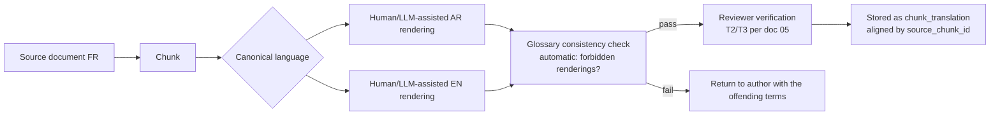

# 06 — Trilingual Experience (FR / AR / EN) & RTL

Three languages are not three translations. In a Tunisian Islamic bank they are three *registers*
over one body of knowledge: customers write in Derja or French, the bank's documents are mostly in
French, the religious vocabulary is Arabic, and the glossary must hold all three together without
ever mistranslating a Sharia term.

## 1. Locales

| Locale | BCP-47 | Direction | Audience | Notes |
|---|---|---|---|---|
| French | `fr-FR` | LTR | Customers, corporate, all bank documentation | Default for `INTERNAL` content |
| Arabic (Tunisia) | `ar-TN` | **RTL** | Customers, retail, religious concepts | Modern Standard Arabic for output; Derja accepted on input |
| English | `en-GB` | LTR | Expatriates, corporate/international, group (ABG) reporting | `en-GB` to match the group's existing spelling conventions |

Adding a fourth language (e.g. `ar-LY`, `it-IT`) is data + dictionaries, never code — every
language-dependent structure is keyed by locale in the DB.

### 1.1 Locale negotiation (ordered)

1. Explicit user choice in the UI (persisted in `user_preference` for authenticated users, in a
   first-party cookie `albaraka_locale` for anonymous ones — 13 months, no personal data).
2. `locale` claim in the Keycloak JWT (mapped from the user profile).
3. Widget embed parameter (`?locale=ar`).
4. URL prefix on the standalone apps (`/ar/…`, `/fr/…`, `/en/…`) — required for SEO and shareable links.
5. `Accept-Language` header (best match among the three).
6. Fallback `fr-FR`.

**Answer language is decided per message, not per session**: a user in a French UI may type in Arabic
and must be answered in Arabic. The UI chrome language and the answer language are independent
(both stored on `message`).

## 2. Language policy for answers

| Rule | Rationale |
|---|---|
| Answer in the language of the question | Customer experience; legally the customer must understand what the bank tells them |
| Retrieved content may be in any of the three languages | One multilingual embedding space; cross-lingual retrieval is a feature (ADR-007) |
| Sharia terms appear in canonical glossary form, with the other-script equivalent in parentheses on first use | «la Mourabaha (المرابحة)» / «المرابحة (Murabaha)» — prevents both mistranslation and loss of meaning |
| Never machine-translate a religious term at generation time | Only `term_glossary` renderings are allowed; the prompt carries the relevant glossary rows |
| Numbers, dates and amounts are formatted for the *answer* locale, but quoted values keep the source's precision | `1 250,000 DT` (fr) / `1.250,000 د.ت` (ar) / `TND 1,250.000` (en) |
| Register: professional, warm, concise; no Derja in output, no religious preaching | Brand + governance |

## 3. i18n mechanism (Angular)

| Option | Pros | Cons | Decision |
|---|---|---|---|
| `@angular/localize` AOT (XLIFF) | Standard, tree-shaken, no runtime fetch | One build per locale → 6 artifacts, language switch requires reload, RTL flip is awkward | ✗ |
| **Runtime dictionaries + CDK `BidiModule`** | Instant switch with RTL flip, one build, admin-editable microcopy later, lazy per-locale JSON | Needs a loader + cache discipline | ✔ |

Implementation:

```
libs/shared-i18n/
├── src/lib/locale.service.ts        ← signal<Locale>, dir signal, Intl formatters
├── src/lib/translate.pipe.ts        ← {{ 'chat.input.placeholder' | t }}
├── src/lib/dictionaries/
│   ├── fr-FR/{common,chat,admin,errors,glossary}.json
│   ├── ar-TN/{…}.json
│   └── en-GB/{…}.json
├── src/lib/bidi/                    ← DirDirective, mirroring helpers, <bdi> wrapper component
├── src/lib/normalize/               ← Arabic normaliser, Derja→MSA map (shared with the backend)
└── src/lib/format/                  ← TND amounts, dates (+ Hijri optional), phone, numbers
```

* Dictionaries are lazy-loaded per namespace (`chat`, `admin`, `errors`) so the frontoffice never
  downloads backoffice copy.
* Keys are namespaced and **never** contain source-language text (`chat.send` not `chat.envoyer`).
* Missing key → visible `⚠ key` in dev/test builds (fails CI), fallback to `fr-FR` in production.
* Backend messages come from `message_bundle` (DB, admin-editable, T1) with
  `messages_{fr,ar,en}.properties` as the compiled fallback.
* The **same** normalisation and Derja maps exist in `libs/shared-i18n` and in
  `assistant-knowledge` — generated from one JSON source (`specs/i18n/normalization.json`) to prevent
  front/back divergence.

## 4. RTL architecture

### 4.1 Document direction
```ts
// locale.service.ts
export const dir = computed(() => (locale().language === 'ar' ? 'rtl' : 'ltr'));
// applied to <html dir> via a host binding; Angular CDK Directionality injected everywhere
```
Switching direction re-renders through signals; no page reload; scroll position and chat history preserved.

### 4.2 CSS rules (enforced by stylelint in CI)

| Do | Don't |
|---|---|
| `margin-inline-start`, `padding-inline-end`, `inset-inline`, `border-inline-start` | `margin-left`, `padding-right`, `left:`, `right:` |
| `text-align: start` / `end` | `text-align: left` |
| Logical flex (`row` follows `dir`) | Hard-coded `row-reverse` hacks |
| Icons mirrored via `[dir=rtl] .icon-chevron { transform: scaleX(-1) }` | Duplicated icon sets |
| `direction: rtl` inherited, with `unicode-bidi: isolate` on embedded LTR runs | Global `!important` direction overrides |

**Mirroring rules of thumb**: chevrons, back arrows, progress, sliders, list bullets → mirror.
Clocks, phone-handsets, media playback, brand logos, checkmarks, numeric axes → **do not** mirror.
Charts (analytics dashboard) flip their axis; Recharts/Apex `rtl` mode is configured per locale.

### 4.3 Mixed-direction content (the hard part)
Banking text constantly mixes scripts: «votre financement Mourabaha de 25 000 DT» inside an Arabic
sentence, IBANs, product codes, URLs, email addresses.

* Every embedded opposite-direction run is wrapped: `<bdi>` (isolate) or `<span dir="ltr">` — never
  left raw, or the bidi algorithm reorders digits and punctuation unpredictably.
* The markdown renderer used for assistant answers applies this automatically: Latin/digit runs in an
  RTL answer get `dir="ltr"` spans; citation markers `[S1]` are isolated.
* `message.dir` is stored so replay in the backoffice renders identically.
* Numbers: **Western Arabic numerals (0–9)** are the default for `ar-TN` — this is standard practice
  in Tunisia for banking. Eastern Arabic numerals (٠١٢٣٤٥٦٧٨٩) are available as a user preference
  (`numeral_system: western | eastern`) and never used in amounts inside contracts/quotes.

### 4.4 Typography

```css
:root {
  --font-latin: "Inter", "Segoe UI", system-ui, sans-serif;
  --font-arabic: "Noto Naskh Arabic", "IBM Plex Sans Arabic", "Cairo", serif;
  --font-size-base-latin: 16px;
  --font-size-base-arabic: 17px;   /* Arabic needs +1px and looser leading for legibility */
  --line-height-arabic: 1.9;
}
```
* Fonts self-hosted (woff2, subsetted) — no third-party font CDN on a banking page (privacy + CSP).
* Arabic fallback stack must include a naskh face; Kufi/decorative faces are unusable at body size.
* Chat bubbles: max line length 70ch (Latin) / 60ch (Arabic).

## 5. Formatting rules

| Item | fr-FR | ar-TN | en-GB |
|---|---|---|---|
| Currency | `1 250,500 DT` | `1.250,500 د.ت` | `TND 1,250.500` |
| Decimal separator | `,` | `,` (with `.` thousands) | `.` |
| Date | `15/03/2026` | `15/03/2026` (+ optional `١٥ رمضان ١٤٤٧` Hijri on request) | `15 Mar 2026` |
| Time | `14:30` | `14:30` | `14:30` (24 h everywhere — banking convention) |
| Phone | `+216 71 123 456` | `+216 71 123 456` | `+216 71 123 456` |

**TND has three decimals** (1 dinar = 1 000 millimes). All amounts are `BigDecimal` with scale 3,
formatted via `Intl.NumberFormat(locale, { style:'currency', currency:'TND', minimumFractionDigits:3 })`
with a post-processing step for the `DT` / `د.ت` symbol placement in RTL. Getting this wrong in a bank
UI is a credibility killer — it is covered by unit tests in `libs/shared-i18n`.

Hijri dates are **informational only** (never used for contractual validity), computed with
`Intl.DateTimeFormat('ar-TN-u-ca-islamic-umalqura')` and labelled as such.

## 6. Glossary & terminology governance

`term_glossary` (doc 03 §2.7) is the single source of truth for terminology, injected into prompts
and enforced by the output classifier. Seed rows (canonical French spellings follow the bank's own
published usage):

| Code | FR (canonical) | AR | EN | Forbidden renderings |
|---|---|---|---|---|
| `MOURABAHA` | Mourabaha | مرابحة | Murabaha (cost-plus sale) | prêt, crédit, loan, interest-bearing sale |
| `MOUSSAWAMA` | Moussawama | مساومة | Musawama (sale at an agreed price) | prêt personnel, personal loan |
| `MOUCHARAKA` | Moucharaka | مشاركة | Musharaka (partnership) | joint-venture loan, crédit participatif |
| `MOUDHARABA` | Moudharaba | مضاربة | Mudaraba (profit-sharing partnership) | placement à intérêt, interest deposit |
| `IJARA` | Ijara (assortie de l'option d'acquisition) | إجارة | Ijara (lease, incl. lease-to-own) | crédit-bail classique, leasing with interest |
| `SALAM` | Salam | سلم | Salam (forward sale with upfront payment) | vente à terme spéculative, futures |
| `ISTISNAA` | Istisna'a | استصناع | Istisna'a (manufacturing/ construction contract) | contrat de construction à intérêt |
| `WAKALA` | Wakala | وكالة | Wakala (agency) | mandat rémunéré à taux fixe |
| `MARGE_BENEF` | marge bénéficiaire | هامش ربح | profit margin | taux d'intérêt, intérêt, rate of interest, نسبة فائدة |
| `RIBA` | riba (proscription de l'intérêt) | ربا | riba (prohibition of interest) | — (concept, never a product) |
| `DEPOT_INVEST` | dépôt d'investissement | حساب استثمار | investment account (IAH) | compte à terme rémunéré |
| `DEPOT_COURANT` | compte courant | حساب جار | current account | — |
| `COMITE_CHARIA` | Comité de contrôle de conformité des normes bancaires islamiques | لجنة مراقبة مطابقة المعايير المصرفية الإسلامية | Islamic Banking Standards Compliance Committee | comité religieux, Sharia board (informal) |
| `AAOIFI` | normes AAOIFI | معايير هيئة المحاسبة والمراجعة للمؤسسات المالية الإسلامية | AAOIFI standards | — |
| `NAFAA_AL_AM` | compte de bienfaisance (Nafaa al Am) | حساب النفع العام | charity account | compte des pénalités |
| `TAKAFUL` | Takaful (assurance coopérative) | تكافل | Takaful (cooperative insurance) | assurance classique |

Governance rules:
* Any row with `sharia_sensitive = true` requires SHARIA_OFFICER approval to change (T3).
* The glossary is **loaded into the generation prompt filtered to terms actually present in the
  retrieved context** (keeps the prompt small).
* A weekly job scans published chunks for forbidden renderings and opens a QA task — terminology drift
  is detected, not hoped away.

## 7. Tunisian Derja (input-only)

| Aspect | Policy |
|---|---|
| Understanding | Derja input is normalised to MSA before retrieval (map in `shared-i18n` + DB) |
| Answering | Always MSA/professional — **never** Derja, and never Derja for religious content |
| Coverage | ~350 seed mappings, grown from real conversation logs (an admin screen proposes new mappings from unanswered/mis-retrieved Derja queries) |
| Examples | `شنيا/شنوة` → `ما هو/ما هي` · `نحب` → `أريد` · `باش` → `من أجل` · `برشة` → `كثيرا` · `فلوس` → `أموال` · `كرهبة` → `سيارة` · `دار/منزل` → `عقار` · `شهرية` → `قسط شهري` · `قداش` → `كم` · `وين` → `أين` |
| Code-switching | Latin-script Derja (`chnowa`, `bch`, `flous`, `9addéch`) mapped too — very common on Tunisian web chat |

Latin-script Derja ("arabizi", including digit substitutions like `9` for ق and `3` for ع) is handled by
a transliteration table before language detection, otherwise such messages are misdetected as French.

## 8. Translating knowledge (content, not UI)



Hard rules:
* **Machine translation is never published without human verification** for `SHARIA_PRINCIPLES`,
  product descriptions and anything T3. For T1 marketing/FAQ content, MT + automated glossary check +
  sampling audit (10 %) is acceptable.
* A chunk and its translations are **one logical unit** for review: approving the French without the
  Arabic leaves the Arabic non-retrievable.
* The reviewer sees source and rendering side by side (bidi-aware diff) in the backoffice.

## 9. UI copy — sample (kept in dictionaries, shown here for review)

| Key | fr-FR | ar-TN | en-GB |
|---|---|---|---|
| `chat.input.placeholder` | Posez votre question… | اطرح سؤالك… | Ask your question… |
| `chat.send` | Envoyer | إرسال | Send |
| `chat.sources` | Sources | المصادر | Sources |
| `chat.thinking` | Je cherche dans la documentation approuvée… | أبحث في الوثائق المعتمدة… | Searching the approved documentation… |
| `chat.feedback.up` | Utile | مفيد | Helpful |
| `chat.feedback.down` | À améliorer | يحتاج تحسين | Needs improvement |
| `chat.feedback.sharia` | Signaler un problème de conformité | الإبلاغ عن إشكال في المطابقة الشرعية | Report a compliance concern |
| `chat.handoff` | Parler à un conseiller | التحدث مع مستشار | Talk to an advisor |
| `chat.disclaimer.notice` | Réponses indicatives — voir les conditions contractuelles | إجابات إرشادية — تُعتمد الشروط التعاقدية | Indicative answers — contract terms prevail |
| `admin.kb.submitReview` | Soumettre à la revue charia | إحالة إلى المراجعة الشرعية | Submit for Sharia review |
| `admin.kb.approve` | Approuver | اعتماد | Approve |
| `admin.review.twoEyes` | Vous ne pouvez pas approuver votre propre soumission | لا يمكنك اعتماد ما قدّمته بنفسك | You cannot approve your own submission |

String-length expansion must be budgeted: FR ≈ +25 % vs EN, AR ≈ +15 % vs EN with taller glyphs.
Layouts are tested at +40 % (pseudo-locale `qxp`) so nothing truncates in any of the three.

## 10. Accessibility in a trilingual RTL app (WCAG 2.2 AA)

* `lang` attribute set **per segment**: `<html lang="ar" dir="rtl">` with
  `<span lang="fr">Mourabaha</span>` inside — screen readers switch voices correctly. This is the most
  commonly broken thing in bilingual banking UIs and it is covered by an automated test.
* Focus order follows visual order in RTL (tested with a keyboard-only Playwright script).
* Citations are buttons with `aria-label="Source 1 : Fiche produit Mourabaha, page 2"` (trilingual).
* Streaming answers expose `aria-live="polite"` with debounce so screen readers do not read every token.
* Contrast ≥ 4.5:1 for the green/gold brand palette; a high-contrast theme is available.
* Angular ARIA (stable in v22) headless components for the chat, table and stepper patterns.
* Reduced-motion respected for the typing indicator and RTL flip transition.

## 11. Testing strategy

| Test | Tool | Gate |
|---|---|---|
| Dictionary completeness (all locales, all keys) | custom script in CI | 100 % — missing key fails the build |
| Pseudo-locale rendering (`qxp`, +40 % length, mirrored) | Playwright screenshots | visual diff < threshold |
| RTL layout | Playwright + axe | no `left/right` violations, no overflow |
| Bidi isolation | unit tests on the markdown renderer | every Latin/digit run wrapped |
| Currency/date formatting | Vitest table-driven | all 3 locales × edge cases (0, 3 decimals, negative, large) |
| Arabic normalisation parity FE/BE | shared JSON fixture tested in both stacks | identical output |
| Answer-language correctness | golden-set cases tagged `EXPECT_ANSWER_LANG` | ≥ 98 % |
| Terminology compliance | golden-set cases asserting canonical terms appear and forbidden ones do not | 100 % |
