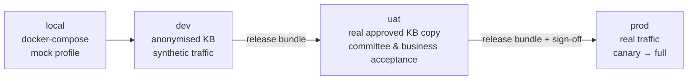
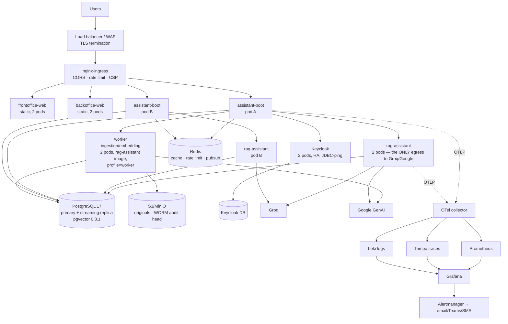

# 12 — Deployment & Observability

## 1. Environments & promotion



A **release bundle** is the unit of promotion and contains four versioned things that must move
together:

| Component | Identifier |
|---|---|
| Application code | git SHA + image tag |
| Knowledge base | `kb_epoch` + list of published document versions |
| Assistant configuration | active prompt versions, retrieval config, model configs, guardrail policies |
| Evaluation evidence | the scorecard of the bundle gate run |

Promoting code without the matching KB epoch (or vice versa) is refused by the pipeline — the most
common cause of "it worked in UAT" in RAG systems is promoting one half of the system.

| Env | Sizing | Data | Access |
|---|---|---|---|
| `local` | developer machine | synthetic 12-document KB | developer |
| `dev` | 2 vCPU / 8 GB app, 2 vCPU / 8 GB PG | anonymised KB | team |
| `uat` | 4 vCPU / 16 GB app, 4 vCPU / 16 GB PG | **real approved KB copy** | team + committee + business |
| `prod` | 2 × 4 vCPU / 16 GB app (HA), 8 vCPU / 32 GB PG + replica | real | ops only; break-glass with reason code |

## 2. Deployment topology

### 2.1 Production (Kubernetes / OpenShift in the bank datacentre)



* **RAG egress is a single choke point**: `rag-assistant` pods are the only containers holding
  `GROQ_API_KEY`/`GOOGLE_API_KEY`. The Spring API talks to them over the internal contract
  (docs/08 §8) with a service token.
* `api` (Spring) and `worker` (Python) are **different images** now; the Python image runs the
  same package with `RAG_ROLE=worker` to consume `ingestion_job`.
* PostgreSQL primary/replica: reads for analytics and admin lists go to the replica; retrieval reads
  stay on the primary for consistency with the `searchable` gate.
* Keycloak runs in HA mode (`jdbc-ping` transport stack, default since 26.1) with persistent user
  sessions enabled.

### 2.2 Local run (docker-compose — what you get on your host)

[`deploy/docker-compose.yml`](../deploy/docker-compose.yml) runs the **full application**:

| Service | Image/build | Port (host) | Notes |
|---|---|---|---|
| `postgres` | `pgvector/pgvector:0.8.1-pg17` | 9004 | UTF8, vector preload, init scripts; Flyway schema + seeds |
| `redis` | `redis:7-alpine` | — | cache, rate-limit, locks |
| `keycloak` | `quay.io/keycloak/keycloak:26.6.3` | 9001 | realm import (sed-substituted), MFA structural, 5 demo users |
| `minio` | `quay.io/minio/minio` (pinned RELEASE) | — (internal only) | document originals, versioned buckets; no host port — `minio-init`, `server` and `rag-assistant` reach it at `http://minio:9000` over the compose network, and publishing 9000/9001 is the classic developer-host failure (port already in use) |
| `rag-assistant` | `deploy/docker/Dockerfile.rag-assistant` | 9003 (health probe) | FastAPI + LangChain; `RAG_PROVIDER_MODE=mock` default |
| `server` | `deploy/docker/Dockerfile.server` (Maven multi-stage) | 9002 | Spring Boot 4.1; Flyway + demo seeds |
| `frontoffice-web` | `deploy/docker/Dockerfile.frontoffice-web` | — | Angular bundle via nginx (edge only) |
| `backoffice-web` | `deploy/docker/Dockerfile.backoffice-web` | — | admin bundle via nginx (edge only) |
| `nginx` | `nginx:1.28-alpine` + `deploy/nginx/nginx.conf` | 9000 | one origin: `/` → frontoffice, `/admin` → backoffice, `/api` → server, SSE unbuffered |

`RAG_PROVIDER_MODE=mock` + empty `GROQ_API_KEY`/`GOOGLE_API_KEY` gives a fully working demo
without any paid API. Set the keys and `RAG_PROVIDER_MODE=live` to use real models. The
`rag-assistant` container is the only service that can reach providers (ADR-009).

**Stale dev database.** The demo data is disposable, but Flyway refuses to adopt a schema that has
no history table (production-safe `baseline-on-migrate: false`). If a volume was created by an older
stack version, `make up` fails with `Found non-empty schema(s) "albaraka_ai" but no schema history
table`. Fix with the surgical reset (postgres volume only — Keycloak, MinIO and Redis state is
kept), then re-run:

```bash
make reset-db
make up
```

`make clean` (stop + remove **all** named volumes) is the heavier alternative and is the only
command that wipes Keycloak/MinIO state too.

## 3. Images & build

| Aspect | Decision |
|---|---|
| Server base image | `eclipse-temurin:21-jre` (or distroless `gcr.io/distroless/java21`) — non-root, no shell in prod |
| Server build | Multi-stage: Maven build in a `maven:3.9-eclipse-temurin-21` stage, layered jar extraction for cache-friendly layers |
| RAG base image | `python:3.12-slim`; deps via `pip` (lockfile) — non-root, `uvicorn --workers 2` |
| Angular | `node:22-alpine` build → `nginx:alpine` static serve (both SPAs, `/api` proxy) |
| SBOM | CycloneDX generated per build, stored as an artifact |
| Signing | cosign keyless (or the bank's registry keys) |
| Scanning | Trivy on every image; HIGH/CRITICAL blocks the push to `prod` registry |
| Tags | immutable: `git-sha` + semantic version; `latest` only on `dev` |
| Size targets | server ≤ 350 MB, web ≤ 40 MB, rag-assistant ≤ 900 MB (dev deps kept out) |

## 4. Configuration & secrets

* 12-factor: all infrastructure coordinates via environment variables; `application.yaml` holds only
  defaults.
* Profiles: `local`, `local-mock`, `dev`, `uat`, `prod`, `worker`, `eval`.
* Secrets from Vault (agent injector or CSI) → env. Nothing in the image, nothing in git
  (`gitleaks` in pre-commit + CI).
* **Runtime behaviour is not configuration**: prompts, retrieval parameters, model routing and policies
  live in the database and are changed through the backoffice (§ doc 09), never through a redeploy.
* A `/admin/operations/config-snapshot` endpoint dumps the effective configuration (redacted) for
  incident diagnosis and attaches it to every release bundle.

## 5. Database operations

| Task | Cadence | Notes |
|---|---|---|
| Flyway migrations | on deploy | `validateOnMigrate=true`; no destructive migration without a rollback script and two approvals |
| `ANALYZE chunk, chunk_embedding` | nightly + after bulk ingestion | planner statistics matter a lot for hybrid queries |
| `REINDEX CONCURRENTLY idx_chunk_emb_hnsw` | quarterly or after > 20 % row churn | HNSW degrades with churn |
| Autovacuum tuning | per table | `chunk_embedding`: `autovacuum_vacuum_scale_factor=0.05` |
| Backup | nightly full + continuous WAL (PITR) | **RPO 5 min, RTO 1 h** |
| Backup encryption & offsite | always | keys separate from backups |
| Restore drill | quarterly | a backup never tested is not a backup |
| S3/MinIO originals | versioned bucket + object lock for the audit head | WORM |
| Archiving | conversations > 24 months anonymised; `llm_call_log` payloads > 12 months dropped | scheduled jobs, monitored |

**Sizing estimate** (planning values):

| Volume | Storage | Notes |
|---|---|---|
| 100 000 chunks × 1536-dim `halfvec` | ≈ 310 MB vectors + 250 MB text + 180 MB indexes | comfortably RAM-resident |
| 1 M chunks | ≈ 3.1 GB vectors + ~4 GB rest | HNSW build ~2–4 h; use `ef_construction=128`, parallel build |
| 10 000 conversations/day | ≈ 1.2 GB/month of messages + traces | partition `message`/`retrieval_candidate` monthly |
| Audit events | ≈ 50 MB/year | 10-year retention trivial |

Partitioning plan: `message`, `retrieval_candidate`, `guardrail_event`, `llm_call_log`, `audit_event`
by month (`PARTITION BY RANGE (created_at)`), with an archival job moving partitions > 24 months to
cold storage.

## 6. Observability

### 6.1 Tracing (OpenTelemetry)

One trace per answer, with a span per pipeline stage — this is what makes a bad answer diagnosable:

```
POST /assistant/conversations/{id}/messages            [2410 ms]
├─ guardrails.preFilter                                [ 240 ms]
│  ├─ groq.prompt-guard-2-86m                          [  80 ms]
│  └─ groq.llama-guard-4-12b                           [ 150 ms]
├─ rag.languageAndIntent                               [ 190 ms]
│  └─ groq.llama-3.1-8b-instant (intent)               [ 180 ms]
├─ rag.queryTransform                                  [ 210 ms]
├─ google.embed (RETRIEVAL_QUERY, 3 texts)             [ 200 ms]
├─ pg.hybridSearch (dense 25 · fts 20 · trgm 10)       [  58 ms]
│    attributes: candidates=47, best_score=0.79
├─ rag.fuse (RRF)                                      [   4 ms]
├─ groq.rerank (llama-3.1-8b-instant)                  [ 310 ms]
├─ rag.assembleContext                                 [   6 ms]  tokens=3120/6000
├─ groq.chat (llama-3.3-70b-versatile, stream)         [1900 ms]  ttft=690 tokens_out=418
├─ guardrails.postFilter                               [ 260 ms]  decision=PASS
└─ persist.trace                                       [  22 ms]
```

Span attributes always include: `locale`, `channel`, `intent`, `audience`, `prompt_version`,
`model_config`, `retrieval_config`, `kb_epoch`, `experiment_arm`, `degradation_step`,
`tokens.in`, `tokens.out`, `cost.usd`, `refusal_code`, `guardrail.decision`, `correlation_id`.

### 6.2 Metrics (Prometheus)

| Family | Metrics |
|---|---|
| RED | `assistant_requests_total{endpoint,status}`, `assistant_request_duration_seconds` (histogram), `assistant_errors_total{code}` |
| RAG | `rag_candidates_total`, `rag_best_score`, `rag_context_tokens`, `rag_cache_hit_total{type}`, `rag_degradation_step_total{step}`, `rag_refusals_total{code}`, `rag_intent_total{intent}`, `rag_answer_language_total{lang}` |
| Guardrails | `guardrail_decisions_total{policy,decision}`, `guardrail_blocked_total{code}`, `pii_redactions_total`, `egress_denied_total{reason}` |
| Providers | `provider_calls_total{provider,model,status}`, `provider_latency_seconds`, `provider_tokens_total{model,direction}`, `provider_cost_usd_total{model}`, `provider_budget_remaining_usd`, `provider_circuit_state{provider}` |
| Ingestion | `ingestion_jobs_total{status}`, `ingestion_queue_depth`, `embedding_job_duration_seconds`, `chunks_pending_embedding` |
| Governance | `reviews_pending{tier}`, `review_age_seconds`, `reviews_sla_breached_total`, `fatwa_requests_open`, `withdraw_events_total` |
| Platform | JVM, Hikari pool, Postgres (`pg_stat_*` via exporter), Redis, HTTP client pools, virtual-thread pinning |
| Frontend (RUM, first-party) | LCP, INP, CLS, stream aborts, locale switch counts |

### 6.3 Logging

Structured JSON, one line per event, mandatory fields: `ts`, `level`, `logger`, `correlation_id`,
`principal` (hashed), `locale`, `channel`, `event`, `duration_ms`. **PII scrubber** applied in the
encoder (a custom Logback/Log4j2 converter) so no CIN, IBAN, phone or email can reach Loki. No prompt
or answer text at `INFO`; at `DEBUG` only in `dev`/`uat` and never in `prod` for `CONFIDENTIAL` contexts.

### 6.4 Dashboards

1. **Executive** — volume by language/channel, answered rate, 👍 rate, cost/day, availability.
2. **RAG quality** — faithfulness (shadow eval), context recall, refusal mix, coverage-gap topics.
3. **Governance** — all KPIs of doc 05 §12, review SLA, incidents.
4. **Provider & cost** — calls, tokens, cost by model and purpose, budget burn-down, cache hit rate,
   degradation ladder usage, circuit states.
5. **Platform SRE** — RED, JVM, DB, Redis, ingestion queue depth, error budget burn.
6. **Security** — guardrail blocks by policy, injection attempts, rate-limit hits, admin actions,
   audit-chain verification status.

### 6.5 Alerting

| Alert | Condition | Severity | Route |
|---|---|---|---|
| Assistant down | 5xx > 5 % for 5 min | S1 | on-call + CIO |
| Kill switch engaged | `assistant.enabled=false` | S1 | Sharia officer + Compliance + CIO |
| Provider circuit open | any provider | S2 | on-call |
| Budget exhausted | `provider_budget_remaining_usd <= 0` | S2 | AI engineer + on-call |
| Degradation ≥ step 4 | > 5 % of answers for 15 min | S2 | on-call |
| Guardrail block spike | > 3× the 7-day baseline for 15 min | S2 | Compliance |
| Sharia-concern feedback | any, unresolved > 24 h | S2 | Sharia officer |
| Ungrounded answers | > 2 % of sampled answers for 1 h | S2 | AI engineer |
| Review SLA breach | any T3 overdue | S3 | Sharia officer |
| Audit chain verification failed | any | **S1** | CISO + Compliance |
| Ingestion queue depth | > 1 000 for 30 min | S3 | AI engineer |
| DB replication lag | > 30 s | S2 | DBA |
| Eval gate red on `main` | nightly | S3 | AI engineer |
| Certificate expiry | < 14 days | S3 | ops |
| Dependency CVE (CRITICAL) | on scan | S2 | security |

## 7. Capacity & scaling

| Dimension | Strategy |
|---|---|
| API pods | HPA on CPU + `provider_calls_in_flight`; 2 → 8 pods |
| Workers | Scale on `ingestion_queue_depth`; ingestion is bursty (bulk imports) |
| Postgres | Vertical first (RAM for the HNSW index), then read replica for analytics/admin; PgBouncer in transaction mode |
| Redis | Single instance + replica; cache loss is tolerable (cost only) |
| Providers | Concurrency limits per model; queue with backpressure; the semantic cache absorbs repeated traffic |
| Peak planning | Ramadan/religious periods and product campaigns raise Sharia-concept and product questions — pre-scale and pre-warm the cache with the top 200 queries |

Load test (k6/Gatling) before go-live: 50 concurrent conversations, 200 msg/min, 30 min soak;
acceptance = P95 < 3 s, error rate < 0.5 %, no memory leak, no connection-pool exhaustion.

## 8. Resilience, DR & runbooks

| Scenario | RTO | RPO | Playbook |
|---|---|---|---|
| App pod failure | < 30 s | 0 | K8s self-heals; health probes; graceful shutdown drains SSE streams |
| Groq outage / rate limit | 0 (degraded) | 0 | Degradation ladder (doc 01 §7.2); alert; optionally switch `model_config` to `ONPREM` |
| Google embeddings outage | 0 for answers (cached vectors) | 0 | Retrieval unaffected; **ingestion pauses** and queues; alert |
| Postgres primary failure | ≤ 15 min | ≤ 5 min | Promote replica (Patroni or manual runbook), repoint, verify audit chain |
| Redis failure | ≤ 5 min | cache only | Cache-aside degrades to direct calls; rate limiting falls back to in-process buckets |
| Keycloak failure | users cannot log in; anonymous chat continues | — | Anonymous frontoffice path is deliberately independent of Keycloak availability |
| Object storage failure | ingestion paused | 0 | Originals are re-fetchable; chunks live in Postgres |
| Full site failure | ≤ 4 h | ≤ 15 min | Restore from backup + WAL, re-import realm, rebuild indexes, re-run eval gate before reopening |
| Data corruption / poisoning | ≤ 1 h to contain | — | Kill switch → withdraw content → restore KB from the last good `kb_epoch` → incident |

**Runbooks** (each a markdown file in `deploy/runbooks/`, tested at least once before go-live):
`provider-outage`, `budget-exhausted`, `db-failover`, `cache-flush`, `kill-switch`, `content-withdrawal`,
`reindex-embedding-model-change`, `keycloak-realm-restore`, `pii-incident`, `sharia-incident`,
`secret-rotation`, `restore-from-backup`, `audit-chain-repair`.

## 9. Security operations

| Activity | Cadence |
|---|---|
| Dependency & image CVE scan | every build; `CRITICAL` blocks promotion |
| Keycloak version tracking | monthly; **minimum 26.6.3** (June 2026 security release); subscribe to advisories |
| Spring AI / Spring Boot CVE tracking | every build; note CVE-2026-22729 / CVE-2026-22730 affected Spring AI 1.0.x/1.1.x — the 2.0 line must be kept patched |
| Secret rotation | 180 days, or immediately on suspicion |
| Access review (who holds which admin role) | quarterly, evidence exported to Compliance |
| Penetration test | annually + before go-live |
| Sharia red-team suite | every release + monthly full run |
| Backup restore drill | quarterly |
| DR drill (incl. kill switch) | semi-annually |
| Log review (admin actions, break-glass) | weekly automated report to Compliance |

## 10. Cost model (planning)

| Item | Monthly estimate | Notes |
|---|---|---|
| Groq generation (10 000 answers/day, 35 % cached) | ≈ $950 | dominant cost; falls with cache hit rate |
| Groq utility (intent, rerank, judges) | ≈ $120 | cheap models |
| Google embeddings (queries) | ≈ $20 | documents are one-off |
| Google embeddings (indexing 1 M tokens) | ≈ $0.15 one-off | re-index on model change |
| Infrastructure (dev + uat + prod, 3 nodes prod) | bank-owned or ≈ $600–1 200 hosted | excludes Keycloak HA if shared |
| Observability stack | usually shared with the bank's platform | — |
| **Total (indicative)** | **≈ $1 700–2 300 / month** at 10 k answers/day | Scales ~linearly with volume minus cache gains |

The **budget guard** is a hard control, not a report: at 80 % of `daily_budget_usd` the system shifts
to the fast model, at 100 % it serves cached/retrieval-only answers, and both thresholds page the
AI engineer. A runaway loop must never produce a five-figure invoice.
