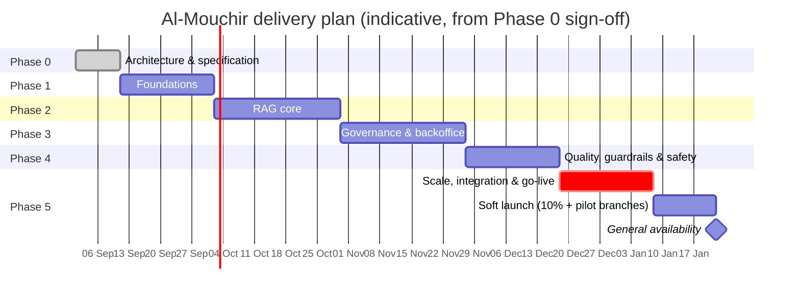

# 13 — Roadmap & Delivery Plan

> **Execution status — 2026-09-03 (architecture update per ADR-009):** the runtime stack is now
> **Spring Boot 4.1 (Java 21) + a dedicated Python RAG service** (FastAPI + LangChain 1.x) + Angular 22.
> The **deliverable is `deploy/docker-compose.yml`** — from your host, `make up` boots the entire
> application (PostgreSQL/pgvector, Redis, Keycloak, MinIO, `server`, `rag-assistant`, `frontoffice-web`, `backoffice-web`, nginx edge) with
> mock providers by default and real Groq/Google once keys are set. The earlier Node parity backend
> is preserved in `legacy/node-parity/` for reference only. Checkmarks below are updated as phases
> reach their acceptance criteria.

## 1. Guiding principles

1. **Governance before generation.** The Sharia gate, audit trail and two-eyes workflow land *with*
   the first customer-facing answer, not after it. An ungoverned assistant that is later constrained
   has to be re-reviewed from scratch.
2. **Vertical slices, not horizontal layers.** Every phase ends with something a business person can
   click and judge.
3. **Measure from day one.** The golden set and the eval harness exist before the backoffice does —
   otherwise there is no way to know whether a change helped.
4. **No personal data until Compliance says so.** v1 is knowledge-only; account servicing is a
   separately governed phase.
5. **Every provider call has a fallback.** The bank must not be one Groq outage away from a broken
   customer experience.

## 2. Phases

### Phase 0 — Architecture & specification ✅ *(this deliverable)*

| | |
|---|---|
| **Scope** | Design docs 00–13, ADRs, glossary, OpenAPI contract, PostgreSQL DDL, Keycloak realm, prompt sources, golden-set seed, docker-compose topology, dependency smoke test |
| **Deliverables** | Everything under `docs/`, `specs/`, `deploy/`, `tools/spike/` |
| **Acceptance** | Walkthrough accepted by Architecture; Compliance confirms the data-flow and residency analysis; Sharia committee chair confirms the review workflow and tiering; the two provider keys validated by `tools/spike` |
| **Effort** | ~12 person-days (done) |
| **Exit risk** | Open questions in doc 00 §9 unanswered → Phase 1 proceeds on infrastructure only |

### Phase 1 — Foundations (3 weeks) 🔶 *executing — Spring backend + Angular workspace*

| | |
|---|---|
| **Objective** | A skeleton that authenticates, persists, migrates, serves three languages and streams a hello — end to end |
| **Tasks** | Monorepo scaffold (Maven parent + modules + ArchUnit rules; Angular workspace + libs) · CI pipeline (build, test, lint, SAST, contract diff, images) · docker-compose (Postgres+pgvector, Redis, Keycloak, MinIO, nginx) · Flyway `V1__` from `specs/db/schema.sql` · Keycloak realm import + roles + MFA · Spring resource server + authority mapping · OpenAPI → TS/Java codegen wired · Angular shells with routing, layout, RTL flip, locale dictionaries, Keycloak PKCE login · `/assistant/config` + a mocked SSE endpoint · actuator, metrics, tracing skeleton · `local-mock` provider profile |
| **Deliverables** | Two running apps, one running backend, one-command local dev, green CI |
| **Acceptance** | (1) `make dev && make server && make web` works from a clean clone; (2) a user logs into the backoffice with MFA and sees a role-gated dashboard; (3) the frontoffice switches FR ↔ AR ↔ EN with correct RTL and no reload; (4) a mock answer streams over SSE and renders with bidi isolation; (5) ArchUnit and the contract check run in CI; (6) coverage ≥ 60 % on the scaffolded modules |
| **Team** | 1 tech lead, 1 backend, 1 frontend, 0.5 DevOps |

### Phase 2 — RAG core (4 weeks) 🔶 *executing — Python LangChain service*

| | |
|---|---|
| **Objective** | Real answers from real approved content, cited, in three languages |
| **Tasks** | Groq adapter (+ option sanitiser, named guard beans) · Google embedding adapter (batching, task types, dimensions) · pgvector `VectorStore` + hybrid retrieval SQL · Arabic/French normaliser + light stemmer + FTS config · Derja map · chunker (heading-aware, per-content-type policies) · ingestion jobs (upload + parse + chunk + embed) with the DB queue · query transform (rewrite, glossary expansion, cross-lingual fallback) · RRF fusion · LLM reranker · context assembler with token budget + MMR · generator with the answer contract · SSE endpoint · citation model + source panel · basic input/output guardrails (lexicon, PII regex, grounding check, numeric validator) · refusal templates · semantic cache · `retrieval_trace` persistence · golden-set v1 (150 cases) + `assistant-eval` module |
| **Deliverables** | Frontoffice answering real questions with citations; a CLI/API eval run producing a scorecard |
| **Acceptance** | (1) 40-question smoke set: faithfulness ≥ 0.85, numeric grounding 100 %, citation accuracy ≥ 0.9; (2) an Arabic Derja question retrieves French content and is answered in Arabic; (3) an unknown question returns REF-05 with the three closest sources and **no invented content**; (4) a religious ruling request returns REF-03 and creates a `fatwa_request`; (5) P95 < 3 s locally with a warm cache; (6) cost per answer measured and within budget; (7) every answer's trace is viewable in the DB |
| **Dependencies** | Phase 1; the bank's seed documents (≥ 50 documents across products, tariffs, procedures); the two API keys with paid-tier quotas |
| **Team** | 1 tech lead, 2 backend (1 RAG-focused), 1 frontend, 0.5 DevOps |

### Phase 3 — Governance & backoffice (4 weeks) 🔶 *executing — core workflow delivered*

*Delivered: document library + lifecycle state machine + publish transaction,
Sharia review board with two-eyes enforcement (self-approval → 422
`GOVERNANCE.SELF_APPROVAL`), hash-chained `audit_event` + verifier
(`GET /admin/audit/verify`), prompts/model/retrieval-config views, budget
dashboard, feedback triage, backoffice UI on :4201.*

| | |
|---|---|
| **Objective** | Administrators own the assistant: content lifecycle, Sharia review, prompts, retrieval tuning, audit |
| **Tasks** | Document library + detail + chunk editor + version diff · upload wizard + ingestion job monitor · lifecycle state machine + publish/withdraw transactions · review board (queue, workspace, chunk-level decisions, trilingual reasons, two-eyes triggers, SLA, escalation) · fatwa-request queue + publish-as-KB · glossary manager + terminology scanner · Derja map manager · prompt studio (editor, variables, protected clauses, diff, preview/replay, canary activation, rollback) · retrieval lab (playground, strategy breakdown, live parameter sliders, A/B compare) · model & provider config + budget panel + test connection · audit log viewer + hash-chain verification + evidence-pack export · RBAC hardening + break-glass reason codes · `assistant_config` (suggested questions, disclaimers, flags) |
| **Deliverables** | A usable backoffice covering every lever in doc 00 §6 |
| **Acceptance** | (1) a KB change cannot be published without the tier-appropriate approvals — verified by an automated test attempting self-approval and T3 without quorum; (2) a Sharia officer can review, approve and publish a bilingual document end to end in < 5 minutes; (3) an AI engineer can change a prompt, preview it against 20 real queries, canary it at 10 % and roll back in one click; (4) the retrieval lab explains why a chunk was not selected; (5) the audit trail for any published document lists every actor and decision; (6) the evidence pack exports and its hash chain verifies |
| **Team** | 1 tech lead, 2 backend, 2 frontend, 0.5 QA |

### Phase 4 — Quality, guardrails & safety (3 weeks) 🔶 *executing — guardrails in the Python service; pytest golden gate*

| | |
|---|---|
| **Objective** | Prove it is safe, and make regression impossible to ship |
| **Tasks** | Groq moderation models integrated (Prompt Guard 2 on messages **and** chunks at ingestion; Llama Guard 4 in/out) · Sharia policy classifier (lexicon + judge with rubric) · hallucinated-entity check · language-consistency check · markdown sanitiser + CSP · rate limiting + captcha · budget guard with the full degradation ladder · golden set to 400 cases + red-team suite (≥ 40 cases) · eval harness in CI (PR subset + nightly full) · release gate + canary auto-rollback · shadow evaluation on 1 % of live traffic · feedback triage + QA queue + "add to golden set" · judge calibration set (100 human-labelled answers, κ ≥ 0.7) · security testing (DAST, dependency, secrets) · load test |
| **Deliverables** | A gated release pipeline and a safety evidence pack |
| **Acceptance** | (1) all release-gate thresholds of doc 11 §4 met on the 400-case set; (2) red team: 100 % of CRITICAL/HIGH blocked, including indirect injection via a poisoned document; (3) PII-leak count = 0 across the whole suite; (4) judge agrees with humans ≥ 85 % on the calibration set; (5) load test passes (50 concurrent, 200 msg/min, P95 < 3 s); (6) a deliberately broken prompt is blocked by the gate and auto-rolled-back in canary |
| **Team** | 1 tech lead, 2 backend, 1 frontend, 1 QA/RAG evaluator, 0.5 security |

### Phase 5 — Scale, integration & go-live (3 weeks) 🔶 *executing — docker-compose on your host; K8s stays target*

| | |
|---|---|
| **Objective** | Production-ready, monitored, and live to real customers |
| **Tasks** | K8s/OpenShift manifests + Helm · HA Postgres + replica + PgBouncer · Keycloak HA · nginx edge config, WAF rules, CSP · full observability (6 dashboards, alerts, runbooks) · backup/PITR + restore drill · DR drill + kill-switch drill · widget build + integration on a staging copy of the bank site · UAT with the Sharia committee and business owners on the real KB · production readiness review · hypercare plan · documentation & training (KB editors, reviewers, agents) |
| **Deliverables** | A live assistant + an operated platform |
| **Acceptance** | (1) UAT sign-off by the Sharia committee and the business owner; (2) production readiness review closed with no open HIGH; (3) DR drill and kill-switch drill executed and documented; (4) restore drill: full recovery ≤ 4 h, RPO ≤ 15 min; (5) dashboards and alerts validated by injecting real failures; (6) 10 KB editors and 3 Sharia officers trained and autonomous; (7) go/no-go decision recorded |
| **Go-live mode** | Soft launch: widget to 10 % of site visitors + agent desk to two pilot branches for 2 weeks, then general availability |
| **Team** | 1 tech lead, 1 backend, 1 frontend, 1 DevOps, 0.5 QA, business + committee reviewers |

### Phase 6 — Extensions (post-launch, each separately scoped)

| Extension | Value | Precondition |
|---|---|---|
| **Agent assist** at all branches | Faster, more consistent customer service | Phase 5 stable; `INTERNAL` content reviewed |
| **Account servicing adapter** (balances, statements, financing status) | The question customers actually ask most | Compliance opinion + core-banking integration project + strong customer authentication + a new DPIA |
| **Voice input** (Groq `whisper-large-v3-turbo`) | Accessibility, Arabic dialects, mobile | Cost/latency validated; consent for audio processing |
| **On-premises inference profile** (vLLM/Ollama + local embeddings) | Full data sovereignty | Compliance requires it, or cost/volume justifies it; GPU capacity |
| **Outbound notifications** (financing milestones) | Engagement | Marketing + Compliance approval; not a chat feature |
| **Cross-entity knowledge sharing** with Al Baraka Banking Group | Group-wide consistency | Group data-governance agreement |
| **Fine-tuned intent/normalisation models** | Lower cost, better Derja handling | ≥ 6 months of labelled traffic |

## 3. Timeline

≈ **19 weeks** from Phase 0 sign-off to general availability, with a soft launch two weeks earlier.
Phases 2 and 3 overlap by ~1 week in practice (the backoffice KB screens can start against the
ingestion API before the RAG core is finished).

## 4. Team

| Role | Phase 1 | 2 | 3 | 4 | 5 | Notes |
|---|---|---|---|---|---|---|
| Tech lead / architect | 1 | 1 | 1 | 1 | 1 | Owns the ADRs and the contract |
| Backend (Java/Spring AI) | 1 | 2 | 2 | 2 | 1 | One RAG-focused from Phase 2 |
| Frontend (Angular) | 1 | 1 | 2 | 1 | 1 | Two in Phase 3 (backoffice is UI-heavy) |
| DevOps / platform | 0.5 | 0.5 | 0.5 | 0.5 | 1 | |
| QA / RAG evaluator | — | 0.5 | 0.5 | 1 | 0.5 | Owns the golden set |
| Security | — | — | 0.2 | 0.5 | 0.3 | |
| **Bank-side (non-negotiable)** | | | | | | |
| Product owner | 0.5 | 0.5 | 0.5 | 0.5 | 1 | Single decision-maker |
| KB editor(s) | 0.5 | 1 | 2 | 1 | 2 | Feeds the KB; the real bottleneck |
| Sharia officer(s) | 0.2 | 0.3 | 0.5 | 0.5 | 0.5 | Review capacity must be committed in advance |
| Compliance / DPO | 0.3 | 0.2 | 0.3 | 0.5 | 0.5 | Data-flow opinion, DPIA, INPDP filing |
| Core banking / IT ops | — | 0.2 | 0.2 | 0.2 | 0.5 | Environments, network, IdP |

Total ≈ **7 FTE vendor-side + 3 FTE bank-side** at peak. The most common failure mode of this kind of
project is under-resourcing the bank-side KB editors and reviewers — the technology is rarely the
critical path, **content approval is**.

## 5. Definition of Done (every story)

* Code reviewed by one peer; CI green (build, unit, integration, ArchUnit, lint, contract diff, SAST,
  secrets, image scan).
* Tests: unit for domain logic, integration for anything touching Postgres/pgvector, no live provider
  calls in PR tests.
* Trilingual: any user-visible string exists in FR/AR/EN and renders correctly in RTL (dictionary
  completeness check is part of CI).
* Accessibility: axe clean for new UI; keyboard operable.
* Audit: any state change emits an audit event.
* Security: no new endpoint without a role annotation; no new egress path without the `EgressGuard`.
* Documentation: OpenAPI updated, CHANGELOG entry, runbook touched if operational behaviour changed.
* Evaluation: if prompts, retrieval, guardrails or KB changed → the PR eval gate ran and passed.

## 6. Milestone demos (what the business sees)

| Milestone | Demo |
|---|---|
| M1 (end Phase 1) | Log into both apps, switch FR/AR/EN with RTL flip, see a streamed mock answer |
| M2 (end Phase 2) | Ask a real question in Derja, get a cited Arabic answer; ask an unknown question, get an honest refusal; ask for a fatwa, get routed to the committee |
| M3 (mid Phase 3) | Upload a PDF → chunks → submit → Sharia officer approves in the review workspace → publish → it is immediately answerable |
| M4 (end Phase 3) | Change a prompt in the studio, preview against 20 real queries, canary at 10 %, roll back |
| M5 (end Phase 4) | Run the red-team suite live; show the gate blocking a bad prompt; show the scorecard |
| M6 (end Phase 5) | UAT with the committee; kill-switch drill; the widget on a staging copy of the bank site |
| GA | Soft launch metrics after 2 weeks: answered rate, 👍 rate, refusals, cost |

## 7. Production readiness review (go-live checklist)

**Functional** — golden-set gate green · red team green · UAT sign-off · all refusal templates reviewed
by the Sharia officer · disclaimers approved · suggested questions approved · agency data current.

**Governance** — committee members provisioned with MFA · review SLAs agreed · evidence pack generated
once successfully · roles reviewed against doc 07 §3 · two-eyes verified by test · kill switch drilled.

**Security** — pen test closed (no HIGH) · DAST clean · secrets in Vault, rotation scheduled · CSP and
headers verified · Keycloak ≥ 26.6.3 · dependency scan clean · PII gate verified with a red-team PII set.

**Compliance** — data-flow diagram signed · DPIA completed · INPDP filing status confirmed · provider
DPAs executed · retention/anonymisation jobs scheduled and tested · audit chain verified.

**Operations** — dashboards and alerts validated by fault injection · runbooks written and walked
through · backup + restore drill done · DR drill done · capacity/load test passed · on-call rota and
escalation matrix published · cost budget and alert thresholds set.

**People** — KB editors trained · Sharia reviewers trained · agents trained · support scripts published
· hypercare plan (2 weeks of daily standups and a live KPI board) agreed.

## 8. First 90 days after go-live

| Period | Focus |
|---|---|
| Weeks 1–2 | Hypercare: daily review of refusals, blocks, 👎, coverage gaps; hot-fix KB wording; tune thresholds |
| Weeks 3–4 | Convert the top 20 coverage gaps into documents; grow the golden set from real traffic to 600 cases; first committee evidence pack |
| Month 2 | First A/B experiment (prompt persona or retrieval weights); agent-desk rollout to all branches; cost optimisation (cache tuning, model routing) |
| Month 3 | Post-implementation review; decide Phase 6 scope (account servicing vs voice vs on-prem inference) with Compliance; annual security test planning |

**Success criteria at day 90**: answered rate ≥ 85 %, 👍 ≥ 80 %, policy-violation rate ≤ 0.3 %,
zero S1 incidents, cost per answer ≤ $0.006, ≥ 700 golden-set cases, ≥ 3 committee-approved coverage
improvements shipped per month, and measurable reduction in repetitive calls to the call centre.

## 9. Budget outline (indicative)

| Item | One-off | Monthly |
|---|---|---|
| Vendor delivery (19 weeks, ~7 FTE peak) | the dominant cost — quote separately | — |
| Bank-side effort (~3 FTE, 19 weeks) | internal | — |
| Infrastructure (dev/uat/prod) | setup | $600–1 200 (or nil if bank-hosted) |
| Model providers (10 k answers/day) | — | ≈ $1 100 (doc 12 §10) |
| Keycloak, observability, WAF | usually shared platform costs | — |
| Training & documentation | small | — |
| Contingency | 15 % of delivery | — |

Cost is highly sensitive to volume and cache hit rate; the budget guard caps the downside.

## 10. What would change this plan

| Trigger | Change |
|---|---|
| Compliance rejects cross-border inference | Swap to the `ONPREM` profile in Phase 2 → +3 weeks, GPU procurement, embedding model change + full re-index |
| The bank wants account servicing in v1 | +8–10 weeks and a separate security/compliance workstream; strongly discouraged |
| Sharia committee cannot commit review capacity | Phase 3 slips; mitigate with T1 auto-approval for already-published content and a paid reviewer pool |
| Existing IdP must be reused instead of Keycloak | ADR-004 revisited; ~1 week of adapter work if it is OIDC-conformant, more if it is SAML/LDAP-only |
| Volume 10× the forecast | Extraction of the ingestion worker and a dedicated retrieval service; PgBouncer + read replicas; reconsider Qdrant/ES (ADR-003 has the exit path) |
| Spring AI 2.x breaking change | Pinned minor + a two-week upgrade buffer per quarter; the adapter layer isolates most of it |
